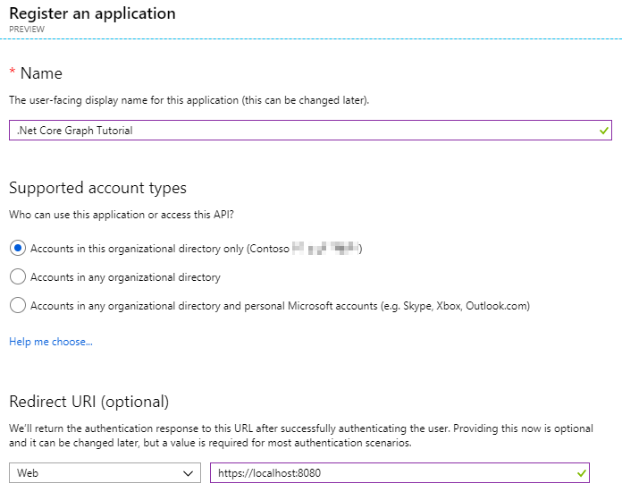
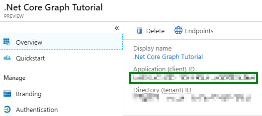
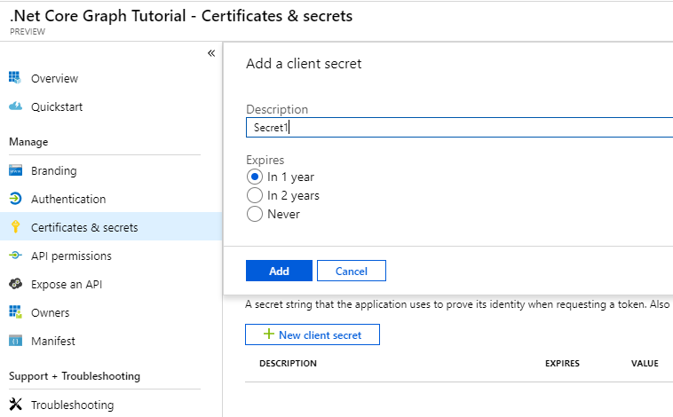
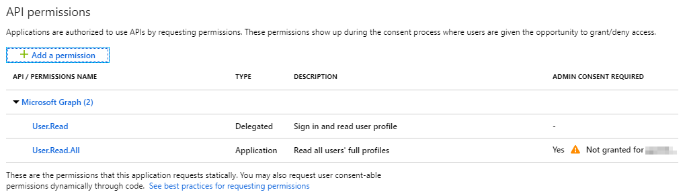

# dotnetcore-console-sample

> ## NOTE

This repo is a work in progress and as such does not have a complete README at this time.  Once ready there will be instructions similar to the [ASP.Net Getting Started lab](https://github.com/microsoftgraph/msgraph-training-aspnetmvcapp/blob/master/Lab.md) for registering an Azure AD application, granting permissions, etc.  For the time being do not treat this as a complete sample.  Thank you for your patience.

- [dotnetcore-console-sample](#dotnetcore-console-sample)
    - [Prerequisites](#prerequisites)
    - [Step 1: Create a .Net Core Console Application](#step-1-create-a-net-core-console-application)
    - [Step 2: Register a web application with the Application Registration Portal](#step-2-register-a-web-application-with-the-application-registration-portal)
    - [Step 3: Extend the app for Azure AD Authentication](#step-3-extend-the-app-for-azure-ad-authentication)
        - [Create helper classes](#create-helper-classes)
    - [Step 4: Extend the app for Microsoft Graph](#step-4-extend-the-app-for-microsoft-graph)
        - [Get user information from tenant](#get-user-information-from-tenant)
    - [Contributing](#contributing)

## Prerequisites

To complete this sample you need the following:

- [Visual Studio Code](https://code.visualstudio.com/) installed on your development machine. If you do not have Visual Studio Code, visit the previous link for download options. (**Note:** This tutorial was written with Visual Studio Code version 1.28.2. The steps in this guide may work with other versions, but that has not been tested.)
- Either a personal Microsoft account with a mailbox on Outlook.com, or a Microsoft work or school account.

If you don't have a Microsoft account, there are a couple of options to get a free account:

- You can [sign up for a new personal Microsoft account](https://signup.live.com/signup?wa=wsignin1.0&rpsnv=12&ct=1454618383&rver=6.4.6456.0&wp=MBI_SSL_SHARED&wreply=https://mail.live.com/default.aspx&id=64855&cbcxt=mai&bk=1454618383&uiflavor=web&uaid=b213a65b4fdc484382b6622b3ecaa547&mkt=E-US&lc=1033&lic=1).
- You can [sign up for the Office 365 Developer Program](https://developer.microsoft.com/office/dev-program) to get a free Office 365 subscription.

## Step 1: Create a .Net Core Console Application

Create a folder for the console application.  Open the command line and navigate to this folder.  Run the following command:

```
dotnet new ConsoleGraphTest
```

Before moving on, install the following NuGet packages that you will use later.

- Microsoft.Identity.Client
- Microsoft.Graph
- Microsoft.Extensions.Configuration
- Microsoft.Extensions.Configuration.FileExtensions
- Microsoft.Extensions.Configuration.Json

Run the following commands to install these NuGet packages:

```
dotnet add package Microsoft.Identity.Client -v 2.1.0-preview
dotnet add package Microsoft.Graph
dotnet add package Microsoft.Extensions.Configuration
dotnet add package Microsoft.Extensions.Configuration.FileExtensions
dotnet add package Microsoft.Extensions.Configuration.Json
```

## Step 2: Register a web application with the Application Registration Portal

In this exercise, you will create a new Azure AD web application registration using the new Azure AD App Registrations UI (in preview as of the time of publish Oct 2018).

1. Open a browser and navigate to the [Azure AD Portal](https://aad.portal.azure.com). Login using a **personal account** (aka: Microsoft Account) or **Work or School Account**.

1. Click Azure Active Directory from the left-hand navigation menu.

1. Select **App registrations (Preview)** from the current blade navigation pane.

    > **Note:** All information and example screenshots are using the preview versions of this registration portal and are subject to change.  We will attempt to update this documentation to match after the portal is generally available (GA).

1. Click **New registration** from the current blade content.

1. On the **Register an application** page, specify the following values:

    - **Name** = .NET Core Graph Tutorial
    - **Supported account types** = \<choose the value that applies to your needs\>
    - **Redirect URI** - https://localhost:8080

    > **Note:** Ensure that the Redirect URI value is unique within your domain.  This value can be changed at a later time and does not need to point to a hosted URI.

    

2. On the **.NET Core Graph Tutorial** page, copy the **Application (client) ID** as you will need it later.

    

1. Select **Certificates & Secrets** from the current blade navigation pane.

    1. Select **New client secret**.
    1. On the **Add a client secret** dialog, specify the following values:

        - **Description** = Secret1
        - **Expires** = In 1 year

    1. Click **Add**.

    


    1. After the screen has updated with the newly created client secret copy the **VALUE** of the client secret as you will need it later.

        > **Important:** This secret string is never shown again, so make sure you copy it now.

    

1. The app registration will need to be granted the necessary permissions to read users via the API. Select **API Permissions** from the currrent blade navigation.

    1. Click the **Add a permission** button
    1. Click on the **Microsoft Graph** option
    1. Click on **Application permissions**
    1. Expand the **User** section
    1. Select the User.Read.All permission
    1. Click **Add permissions**

        > **Important** As this is using application permissions Admin consent must be obtained.

    

    1. Click the **Grant admin consent for <domain>** button
    1. Click on **Yes** in the blade that pops up
        > **Important** Admin consent automatically grants consent on behalf of all users in the tenant, take care when using this option.

## Step 3: Extend the app for Azure AD Authentication

In this step you will extend the application from the previous step to support authentication with Azure AD. This is required to obtain the necessary OAuth access token to call the Microsoft Graph. In this step you will integrate the [Microsoft Authentication Library](https://www.nuget.org/packages/Microsoft.Identity.Client/) library into the application.

1. Rename the `appsettings.json.example` file to `appsettings.json`.
1. Edit `appsettings.json`:
    1. Replace `YOUR_APP_ID_HERE` with your application ID from the App Registration Portal.
    2. Replace `YOUR_APP_SECRET_HERE` with your application password from the App Registration Portal.
    3. Replace `YOUR_TENANT_ID_HERE` with your tenant ID.

> **Important:** If you're using source control such as git, now would be a good time to exclude the `appsettings.json` file from source control to avoid inadvertently leaking your app ID and secret.

### Create helper classes

1. Create a new folder called `Helpers`
1. Create a new file in the `Helpers` folder called `AuthHandler.cs`
1. Replace the contents of `AuthHandler.cs` with the following code:

```cs
using System;
using System.Collections.Generic;
using System.Net.Http;
using System.Net.Http.Headers;
using System.Threading.Tasks;
using Microsoft.Identity.Client;
using Microsoft.Graph;
using Microsoft.Extensions.Configuration;
using System.Linq;
using System.Threading;

namespace ConsoleGraphTest
{
    // This class allows an implementation of IAuthenticationProvider to be inserted into the DelegatingHandler
    // pipeline of an HttpClient instance.  In future versions of GraphSDK, many cross-cutting concernts will
    // be implemented as DelegatingHandlers.  This AuthHandler will come in the box.
    public class AuthHandler : DelegatingHandler {
        private IAuthenticationProvider _authenticationProvider;

        public AuthHandler(IAuthenticationProvider authenticationProvider, HttpMessageHandler innerHandler)
        {
            InnerHandler = innerHandler;
            _authenticationProvider = authenticationProvider;
        }

        protected override async Task<HttpResponseMessage> SendAsync(HttpRequestMessage request, CancellationToken cancellationToken)
        {
            await _authenticationProvider.AuthenticateRequestAsync(request);
            return await base.SendAsync(request,cancellationToken);
        }
    }
}
```

1. Create a new file in the `Helpers` folder called `MsalAuthenticationProvider.cs`
1. Replace the contents of `MsalAuthenticationProvider.cs` with the following code:

```cs
using System;
using System.Collections.Generic;
using System.Net.Http;
using System.Net.Http.Headers;
using System.Threading.Tasks;
using Microsoft.Identity.Client;
using Microsoft.Graph;
using Microsoft.Extensions.Configuration;
using System.Linq;

namespace ConsoleGraphTest
{
    // This class encapsulates the details of getting a token from MSAL and exposes it via the
    // IAuthenticationProvider interface so that GraphServiceClient or AuthHandler can use it.
    // A significantly enhanced version of this class will in the future be available from
    // the GraphSDK team.  It will supports all the types of Client Application as defined by MSAL.
    public class MsalAuthenticationProvider : IAuthenticationProvider
    {
        private ConfidentialClientApplication _clientApplication;
        private string[] _scopes;

        public MsalAuthenticationProvider(ConfidentialClientApplication clientApplication, string[] scopes) {
            _clientApplication = clientApplication;
            _scopes = scopes;
        }

        /// <summary>
        /// Update HttpRequestMessage with credentials
        /// </summary>
        public async Task AuthenticateRequestAsync(HttpRequestMessage request)
        {
            var token = await GetTokenAsync();
            request.Headers.Authorization = new AuthenticationHeaderValue("bearer", token);
        }

        /// <summary>
        /// Acquire Token
        /// </summary>
        public async Task<string> GetTokenAsync()
        {
            AuthenticationResult authResult = null;
            authResult = await _clientApplication.AcquireTokenForClientAsync(_scopes);
            return authResult.AccessToken;
        }
    }
}
```

## Step 4: Extend the app for Microsoft Graph

In this step you will incorporate the Microsoft Graph into the application. For this application, you will use the [Microsoft Graph Client Library for .NET](https://github.com/microsoftgraph/msgraph-sdk-dotnet) to make calls to Microsoft Graph.

### Get user information from tenant

Start by opening the `Program.cs` file.  Add the following "using" statements to the top of the file.

```cs
using System;
using System.Collections.Generic;
using System.Net.Http;
using System.Net.Http.Headers;
using System.Threading.Tasks;
using Microsoft.Identity.Client;
using Microsoft.Graph;
using Microsoft.Extensions.Configuration;
```

Inside the `Program` class add static references to `GraphServiceClient` and `HttpClient`.  These static variables can be used to instantiate the clients used to make calls against the Microsoft Graph.

```cs
private static GraphServiceClient _graphServiceClient;
private static HttpClient _httpClient;
```

Add a new method `LoadAppSettings` with the following definition.  This method retrieves the configuration values from a separate file.  This allows updating the configuration (client Id, client secret, etc.) independently of the code itself.  This is a general best practice when possible to separate configuration from code.

```cs
private static IConfigurationRoot LoadAppSettings()
{
    try
    {
        var config = new ConfigurationBuilder()
        .SetBasePath(System.IO.Directory.GetCurrentDirectory())
        .AddJsonFile("appsettings.json", false, true)
        .Build();

        // Validate required settings
        if (string.IsNullOrEmpty(config["applicationId"]) ||
            string.IsNullOrEmpty(config["applicationSecret"]) ||
            string.IsNullOrEmpty(config["redirectUri"]) ||
            string.IsNullOrEmpty(config["tenantId"]))
        {
            return null;
        }

        return config;
    }
    catch (System.IO.FileNotFoundException)
    {
        return null;
    }
}
```

Add a new method `CreateAuthorizationProvider` that will be used in later methods to instantiate the clients used for making calls against the Microsoft Graph.  This method uses the configuration data with a `ConfidentialClientApplication`.

```cs
private static IAuthenticationProvider CreateAuthorizationProvider(IConfigurationRoot config)
{
    var clientId = config["applicationId"];
    var clientSecret = config["applicationSecret"];
    var redirectUri = config["redirectUri"];
    var authority = $"https://login.microsoftonline.com/{config["tenantId"]}/v2.0";

    List<string> scopes = new List<string>();
    scopes.Add("https://graph.microsoft.com/.default");

    var cca = new ConfidentialClientApplication(clientId, authority, redirectUri, new ClientCredential(clientSecret), null, null);
    return new MsalAuthenticationProvider(cca, scopes.ToArray());
}
```

Add a new method `GetAuthenticatedGraphClient` with the following definition.  This method creates an instance of the `GraphServiceClient` from the static reference.  The `GraphServiceClient` instance uses the configuration returned from previous method.

```cs
private static GraphServiceClient GetAuthenticatedGraphClient(IConfigurationRoot config)
{
    var authenticationProvider = CreateAuthorizationProvider(config);
    _graphServiceClient = new GraphServiceClient(authenticationProvider);
    return _graphServiceClient;
}
```

Add a new method `GetAuthenticatedHTTPClient` with the following definition.  This method creates an instance of the `HTTPClient` from the static reference.  The `HTTPClient` instance uses the configuration returned from previous method.

```cs
private static HttpClient GetAuthenticatedHTTPClient(IConfigurationRoot config)
{
    var authenticationProvider = CreateAuthorizationProvider(config);
    _httpClient = new HttpClient(new AuthHandler(authenticationProvider, new HttpClientHandler()));
    return _httpClient;
}
```

Inside the `Main` method add the following to load the configuration settings.

```cs
var config = LoadAppSettings();
if (null == config)
{
    Console.WriteLine("Missing or invalid appsettings.json file. Please see README.md for configuration instructions.");
    return;
}
```

Continuing in the `Main` method add the following to get an authenticated instance of the `GraphServiceClient` and send a request to retrieve the first user from Users endpoint on the Microsoft Graph.

```cs
GraphServiceClient graphClient = GetAuthenticatedGraphClient(config);
List<QueryOption> options = new List<QueryOption>
{
    new QueryOption("$top", "1")
};

var graphResult = graphClient.Users.Request(options).GetAsync().Result;
Console.WriteLine(graphResult[0].UserPrincipalName);
```

This completes all file edits and additions.  Ensure all files are saved.  Run the following commands from the command line:

```
dotnet build
dotnet run
```

Consider what this code is doing.

- The `GetAuthenticatedGraphClient` function initializes a `GraphServiceClient` with an authentication provider that calls `AcquireTokenForClientAsync`.
- In the `Main` function:
  - The URL that will be called is `/v1.0/users/$top=1`.

## Contributing

This project welcomes contributions and suggestions.  Most contributions require you to agree to a
Contributor License Agreement (CLA) declaring that you have the right to, and actually do, grant us
the rights to use your contribution. For details, visit https://cla.microsoft.com.

When you submit a pull request, a CLA-bot will automatically determine whether you need to provide
a CLA and decorate the PR appropriately (e.g., label, comment). Simply follow the instructions
provided by the bot. You will only need to do this once across all repos using our CLA.

This project has adopted the [Microsoft Open Source Code of Conduct](https://opensource.microsoft.com/codeofconduct/).
For more information see the [Code of Conduct FAQ](https://opensource.microsoft.com/codeofconduct/faq/) or
contact [opencode@microsoft.com](mailto:opencode@microsoft.com) with any additional questions or comments.
