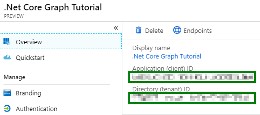

# Base Console Application Setup

- [Base Console Application Setup](#base-console-application-setup)
  - [Prerequisites](#prerequisites)
  - [Step 1: Create a .Net Core Console Application](#step-1-create-a-net-core-console-application)
  - [Step 2: Register a web application with the new Azure AD Portal App Registration](#step-2-register-a-web-application-with-the-new-azure-ad-portal-app-registration)
  - [Step 3: Extend the app for Azure AD Authentication](#step-3-extend-the-app-for-azure-ad-authentication)
    - [Create helper classes](#create-helper-classes)
  - [Step 4: Extend the app for Microsoft Graph](#step-4-extend-the-app-for-microsoft-graph)
    - [Get user information from tenant](#get-user-information-from-tenant)

## Prerequisites

To complete this sample you need the following:

- [Visual Studio Code](https://code.visualstudio.com/) installed on your development machine. If you do not have Visual Studio Code, visit the previous link for download options. (**Note:** This tutorial was written with Visual Studio Code version 1.52.1. The steps in this guide may work with other versions, but that has not been tested.)
- [.Net Core SDK](https://dotnet.microsoft.com/download/dotnet/5.0#sdk-5.0.101). (**Note** This tutorial was written with .Net Core SDK 5.0.101.  The steps in this guide may work with other versions, but that has not been tested.)
- [C# extension for Visual Studio Code](https://marketplace.visualstudio.com/items?itemName=ms-vscode.csharp)
- Either a personal Microsoft account with a mailbox on Outlook.com, or a Microsoft work or school account.

If you don't have a Microsoft account, there are a couple of options to get a free account:

- You can [sign up for a new personal Microsoft account](https://signup.live.com/signup?wa=wsignin1.0&rpsnv=12&ct=1454618383&rver=6.4.6456.0&wp=MBI_SSL_SHARED&wreply=https://mail.live.com/default.aspx&id=64855&cbcxt=mai&bk=1454618383&uiflavor=web&uaid=b213a65b4fdc484382b6622b3ecaa547&mkt=E-US&lc=1033&lic=1).
- You can [sign up for the Office 365 Developer Program](https://developer.microsoft.com/office/dev-program) to get a free Office 365 subscription.

## Step 1: Create a .Net Core Console Application

1. Create a folder called `ConsoleGraphTest` for the console application.

    > **Note:** For the purposes of this sample the project folder was named **ConsoleGraphTest**. If you choose a different folder name ensure that the namespace for files matches.

1. Open the command line and navigate to this folder.  Run the following command:

    ```cmd
    dotnet new console
    ```

1. Before moving on, install the following NuGet packages that you will use later.

    - Microsoft.Identity.Client
    - Microsoft.Graph
    - Microsoft.Extensions.Configuration
    - Microsoft.Extensions.Configuration.FileExtensions
    - Microsoft.Extensions.Configuration.Json

    Run the following commands to install these NuGet packages:

    ```
    dotnet add package Microsoft.Identity.Client --version 4.22.0
    dotnet add package Microsoft.Graph
    dotnet add package Microsoft.Extensions.Configuration
    dotnet add package Microsoft.Extensions.Configuration.FileExtensions
    dotnet add package Microsoft.Extensions.Configuration.Json
    ```

## Step 2: Register a web application with the new Azure AD Portal App Registration

In this exercise, you will create an Azure AD app registration using the new Azure AD Portal App Registrations UI.

1. Open a browser and navigate to the [Azure AD Portal](https://go.microsoft.com/fwlink/?linkid=2083908) app registration page. Login using a **personal account** (aka: Microsoft Account) or **Work or School Account** with permissions to create app registrations.

    > **Note:** If you do not have permissions to create app registrations contact your Azure AD domain administrators.

1. Click **New registration** from the current page.

1. On the **Register an application** page, specify the following values:

    - **Name** = .NET Core Graph Tutorial
    - **Supported account types** = \<choose the value that applies to your needs\>
    - **Redirect URI**
        - Type (dropdown) = Web
        - Value = https://localhost:8080

    > **Note:** Ensure that the Redirect URI value is unique within your domain.  This value can be changed at a later time and does not need to point to a hosted URI.  If the example URI above is already used please choose a unique value.

    

    1. Copy the **Redirect URI** as you will need it later.

1. On the **.NET Core Graph Tutorial** page, copy the **Application (client) ID** and **Directory (tenant) ID** as you will need both later.

    

1. Click **Certificates & secrets** from the current blade navigation pane.

    1. Click **New client secret**.
    1. On the **Add a client secret** dialog, specify the following values:

        - **Description** = ConsoleGraphTest App Secret
        - **Expires** = In 1 year

    1. Click **Add**.

        

    1. After the screen has updated with the newly created client secret copy the **VALUE** of the client secret as you will need it later.

        > **Important:** This secret string is never shown again, so make sure you copy it now.

        

1. Click **API permissions** from the current blade navigation pane.

    1. Click **Add a permission** from the current blade content.
    1. On the **Request API permissions** flyout select **Microsoft Graph**.

        

    1. Select **Application permissions**.
    1. In the "Select permissions" search box type "User".
    1. Select **User.Read.All** from the filtered list.

        

    1. Click **Add permissions** at the bottom of flyout.

1. Back on the API permissions content blade, click **Grant admin consent for \<name of tenant\>**.

    

    1. Click **Yes**.

## Step 3: Extend the app for Azure AD Authentication

In this step you will extend the application from the previous step to support authentication with Azure AD. This is required to obtain the necessary OAuth access token to call the Microsoft Graph. In this step you will integrate the [Microsoft Authentication Library](https://www.nuget.org/packages/Microsoft.Identity.Client/) library into the application.

1. On the command line from Step 1, run the following command inside the project folder to open Visual Studio Code with the project folder opened:

    ```
    code .
    ```

1. Add a file to the folder named `appsettings.json` with the following content:

    ```json
    {
        "applicationId": "YOUR_APP_ID_HERE",
        "applicationSecret": "YOUR_APP_SECRET_HERE",
        "tenantId": "YOUR_TENANT_ID_HERE",
        "redirectUri": "YOUR_REDIRECT_URI_HERE",
        "domain": "YOUR_DOMAIN_HERE"
    }
    ```

1. Edit `appsettings.json` and fill in the values obtained in previous step on the Azure AD Portal app registration UI:
    1. Replace `YOUR_APP_ID_HERE` with your application ID.
    1. Replace `YOUR_APP_SECRET_HERE` with your client secret (VALUE from Secret1 in previous steps).
    1. Replace `YOUR_TENANT_ID_HERE` with your tenant (domain) ID.
    1. Replace `YOUR_REDIRECT_URI_HERE` with your application redirect URI.
    1. Replace `YOUR_DOMAIN_HERE` with a vaild domain for your Azure Active Directory instance, e.g. contoso.onmicrosoft.com or contoso.com

> **Important:** If you're using source control such as git, now would be a good time to exclude the `appsettings.json` file from source control to avoid inadvertently leaking your app ID and secret.

### Create helper classes

1. Create a new folder called `Helpers`.
1. Create a new file in the `Helpers` folder called `AuthHandler.cs`.
1. Replace the contents of `AuthHandler.cs` with the following code:

    ```cs
    using System;
    using System.Collections.Generic;
    using System.Net.Http;
    using System.Net.Http.Headers;
    using System.Threading.Tasks;
    using Microsoft.Identity.Client;
    using Microsoft.Graph;
    using Microsoft.Extensions.Configuration;
    using System.Linq;
    using System.Threading;

    namespace ConsoleGraphTest
    {
        // This class allows an implementation of IAuthenticationProvider to be inserted into the DelegatingHandler
        // pipeline of an HttpClient instance.  In future versions of GraphSDK, many cross-cutting concernts will
        // be implemented as DelegatingHandlers.  This AuthHandler will come in the box.
        public class AuthHandler : DelegatingHandler {
            private IAuthenticationProvider _authenticationProvider;

            public AuthHandler(IAuthenticationProvider authenticationProvider, HttpMessageHandler innerHandler)
            {
                InnerHandler = innerHandler;
                _authenticationProvider = authenticationProvider;
            }

            protected override async Task<HttpResponseMessage> SendAsync(HttpRequestMessage request, CancellationToken cancellationToken)
            {
                await _authenticationProvider.AuthenticateRequestAsync(request);
                return await base.SendAsync(request,cancellationToken);
            }
        }
    }
    ```

1. Create a new file in the `Helpers` folder called `MsalAuthenticationProvider.cs`
1. Replace the contents of `MsalAuthenticationProvider.cs` with the following code:

    ```cs
    using System;
    using System.Collections.Generic;
    using System.Net.Http;
    using System.Net.Http.Headers;
    using System.Threading.Tasks;
    using Microsoft.Identity.Client;
    using Microsoft.Graph;
    using Microsoft.Extensions.Configuration;
    using System.Linq;

    namespace ConsoleGraphTest
    {
        // This class encapsulates the details of getting a token from MSAL and exposes it via the
        // IAuthenticationProvider interface so that GraphServiceClient or AuthHandler can use it.
        // A significantly enhanced version of this class will in the future be available from
        // the GraphSDK team.  It will supports all the types of Client Application as defined by MSAL.
        public class MsalAuthenticationProvider : IAuthenticationProvider
        {
            private IConfidentialClientApplication _clientApplication;
            private string[] _scopes;

            public MsalAuthenticationProvider(IConfidentialClientApplication clientApplication, string[] scopes) {
                _clientApplication = clientApplication;
                _scopes = scopes;
            }

            /// <summary>
            /// Update HttpRequestMessage with credentials
            /// </summary>
            public async Task AuthenticateRequestAsync(HttpRequestMessage request)
            {
                var token = await GetTokenAsync();
                request.Headers.Authorization = new AuthenticationHeaderValue("bearer", token);
            }

            /// <summary>
            /// Acquire Token
            /// </summary>
            public async Task<string> GetTokenAsync()
            {
                AuthenticationResult authResult = null;
                authResult = await _clientApplication.AcquireTokenForClient(_scopes)
                                    .ExecuteAsync();
                return authResult.AccessToken;
            }
        }
    }
    ```

## Step 4: Extend the app for Microsoft Graph

In this step you will incorporate the Microsoft Graph into the application. For this application, you will use the [Microsoft Graph Client Library for .NET](https://github.com/microsoftgraph/msgraph-sdk-dotnet) to make calls to Microsoft Graph.

### Get user information from tenant

1. Opening the `Program.cs` file.  Add the following "using" statements to the top of the file.

    ```cs
    using System;
    using System.Collections.Generic;
    using System.Net.Http;
    using System.Net.Http.Headers;
    using System.Threading.Tasks;
    using Microsoft.Identity.Client;
    using Microsoft.Graph;
    using Microsoft.Extensions.Configuration;
    ```

1. Ensure that the namespace matches across the project.  In this example we have used **ConsoleGraphTest**.  Update the namespace accordingly if needed.

1. Inside the `Program` class add static references to `GraphServiceClient` and `HttpClient`.  These static variables can be used to instantiate the clients used to make calls against the Microsoft Graph.

    ```cs
    private static GraphServiceClient _graphServiceClient;
    private static HttpClient _httpClient;
    ```

1. Inside the `Program` class add a new method `LoadAppSettings` with the following definition.  This method retrieves the configuration values from a separate file.  This allows updating the configuration (client Id, client secret, etc.) independently of the code itself.  This is a general best practice when possible to separate configuration from code.

    ```cs
    private static IConfigurationRoot LoadAppSettings()
    {
        try
        {
            var config = new ConfigurationBuilder()
            .SetBasePath(System.IO.Directory.GetCurrentDirectory())
            .AddJsonFile("appsettings.json", false, true)
            .Build();

            // Validate required settings
            if (string.IsNullOrEmpty(config["applicationId"]) ||
                string.IsNullOrEmpty(config["applicationSecret"]) ||
                string.IsNullOrEmpty(config["redirectUri"]) ||
                string.IsNullOrEmpty(config["tenantId"]) ||
                string.IsNullOrEmpty(config["domain"]))
            {
                return null;
            }

            return config;
        }
        catch (System.IO.FileNotFoundException)
        {
            return null;
        }
    }
    ```

1. Inside the `Program` class add a new method `CreateAuthorizationProvider` that will be used in later methods to instantiate the clients used for making calls against the Microsoft Graph.  This method uses the configuration data with a `ConfidentialClientApplicationBuilder`.

    ```cs
    private static IAuthenticationProvider CreateAuthorizationProvider(IConfigurationRoot config)
    {
        var clientId = config["applicationId"];
        var clientSecret = config["applicationSecret"];
        var redirectUri = config["redirectUri"];
        var authority = $"https://login.microsoftonline.com/{config["tenantId"]}/v2.0";

        List<string> scopes = new List<string>();
        scopes.Add("https://graph.microsoft.com/.default");

        var cca = ConfidentialClientApplicationBuilder.Create(clientId)
                                                .WithAuthority(authority)
                                                .WithRedirectUri(redirectUri)
                                                .WithClientSecret(clientSecret)
                                                .Build();
        return new MsalAuthenticationProvider(cca, scopes.ToArray());
    }
    ```

1. Inside the `Program` class add a new method `GetAuthenticatedGraphClient` with the following definition.  This method creates an instance of the `GraphServiceClient` from the static reference.  The `GraphServiceClient` instance uses the configuration returned from previous method.

    ```cs
    private static GraphServiceClient GetAuthenticatedGraphClient(IConfigurationRoot config)
    {
        var authenticationProvider = CreateAuthorizationProvider(config);
        _graphServiceClient = new GraphServiceClient(authenticationProvider);
        return _graphServiceClient;
    }
    ```

1. Inside the `Program` class add a new method `GetAuthenticatedHTTPClient` with the following definition.  This method creates an instance of the `HTTPClient` from the static reference.  The `HTTPClient` instance uses the configuration returned from previous method.

    ```cs
    private static HttpClient GetAuthenticatedHTTPClient(IConfigurationRoot config)
    {
        var authenticationProvider = CreateAuthorizationProvider(config);
        _httpClient = new HttpClient(new AuthHandler(authenticationProvider, new HttpClientHandler()));
        return _httpClient;
    }
    ```

1. Inside the `Main` method add the following to load the configuration settings.

    ```cs
    var config = LoadAppSettings();
    if (null == config)
    {
        Console.WriteLine("Missing or invalid appsettings.json file. Please see README.md for configuration instructions.");
        return;
    }
    ```

1. Continuing in the `Main` method add the following to get an authenticated instance of the `GraphServiceClient` and send a request to retrieve the first user from Users endpoint on the Microsoft Graph.

    ```cs
    //Query using Graph SDK (preferred when possible)
    GraphServiceClient graphClient = GetAuthenticatedGraphClient(config);
    List<QueryOption> options = new List<QueryOption>
    {
        new QueryOption("$top", "1")
    };

    var graphResult = graphClient.Users.Request(options).GetAsync().Result;
    Console.WriteLine("Graph SDK Result");
    Console.WriteLine(graphResult[0].DisplayName);
    ```

1. Continuing in the `Main` method add the following to get an authenticated instance of the `HttpClient` and send a request to retrieve the first user from Users endpoint on the Microsoft Graph.

    ```cs
    //Direct query using HTTPClient (for beta endpoint calls or not available in Graph SDK)
    HttpClient httpClient = GetAuthenticatedHTTPClient(config);
    Uri Uri = new Uri("https://graph.microsoft.com/v1.0/users?$top=1");
    var httpResult = httpClient.GetStringAsync(Uri).Result;

    Console.WriteLine("HTTP Result");
    Console.WriteLine(httpResult);
    ```

This completes our first set of file edits and additions.  Ensure all files are saved.  In order to test the console application run the following commands from the command line:

```
dotnet build
dotnet run
```

Consider what this code is doing.

- The `GetAuthenticatedGraphClient` function initializes a `GraphServiceClient` with an authentication provider that calls `AcquireTokenForClient(<scopes>).ExecuteAsync()`.
- In the `Main` function:
  - The graph endpoint that will be called is `/v1.0/users/$top=1`.
- The `HttpClient` call with a manually constructed url and the `GraphServiceClient` SDK call are functionally equivalent. Which you choose to use in your applications will depend on your team practices, coding styles, and target languages.
