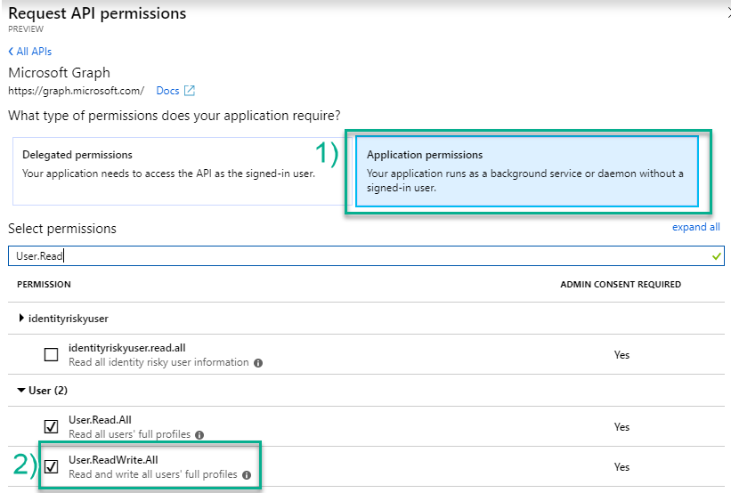
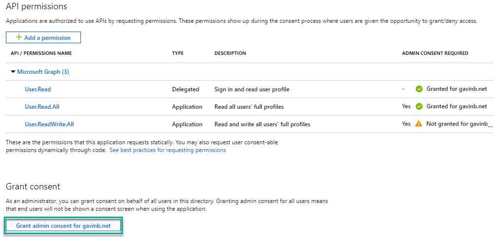

# Day 16 - Create a new User

- [Day 16 - Create a new User](#day-16---create-a-new-user)
  - [Prerequisites](#prerequisites)
  - [Step 1: Update the App Registration permissions](#step-1-update-the-app-registration-permissions)
  - [Step 2: Extend the app to create users](#step-2-extend-the-app-to-create-users)
    - [Create the UserHelper class](#create-the-userhelper-class)
    - [Extend program to create users](#extend-program-to-create-users)

## Prerequisites

To complete this sample you need the following:

- Complete the [Base Console Application Setup](../base-console-app/)
- [Visual Studio Code](https://code.visualstudio.com/) installed on your development machine. If you do not have Visual Studio Code, visit the previous link for download options. (**Note:** This tutorial was written with Visual Studio Code version 1.28.2. The steps in this guide may work with other versions, but that has not been tested.)
- [.Net Core SDK](https://www.microsoft.com/net/download/dotnet-core/2.1#sdk-2.1.403). (**Note** This tutorial was written with .Net Core SDK 2.1.403.  The steps in this guide may work with other versions, but that has not been tested.)
- [C# extension for Visual Studio Code](https://marketplace.visualstudio.com/items?itemName=ms-vscode.csharp)
- Either a personal Microsoft account with a mailbox on Outlook.com, or a Microsoft work or school account.

If you don't have a Microsoft account, there are a couple of options to get a free account:

- You can [sign up for a new personal Microsoft account](https://signup.live.com/signup?wa=wsignin1.0&rpsnv=12&ct=1454618383&rver=6.4.6456.0&wp=MBI_SSL_SHARED&wreply=https://mail.live.com/default.aspx&id=64855&cbcxt=mai&bk=1454618383&uiflavor=web&uaid=b213a65b4fdc484382b6622b3ecaa547&mkt=E-US&lc=1033&lic=1).
- You can [sign up for the Office 365 Developer Program](https://developer.microsoft.com/office/dev-program) to get a free Office 365 subscription.

## Step 1: Update the App Registration permissions

As this exercise requires new permissions the App Registration needs to be updated to include  the **User.ReadWrite.All** permission using the new Azure AD Portal App Registrations UI (in preview as of the time of publish Nov 2018).

1. Open a browser and navigate to the [Azure AD Portal](https://aad.portal.azure.com). Login using a **personal account** (aka: Microsoft Account) or **Work or School Account** with permissions to create app registrations.

    > **Note:** If you do not have permissions to create app registrations contact your Azure AD domain administrators.

1. Select **Azure Active Directory** from the left-hand navigation menu, then **App registrations (preview)**.

1. Click on the **.NET Core Graph Tutorial** item in the list

    > **Note:** If you used a different name while completing the [Base Console Application Setup](../base-console-app/) select that instead.

1. Click **API permissions** from the current page.

    1. Click **Add a permission** from the current blade content.
    1. On the **Request API permissions** flyout select **Microsoft Graph**.

        

    1. Select **Application permissions**.
    1. In the "Select permissions" search box type "User".
    1. Select **User.ReadWrite.All** from the filtered list.

        

    1. Click **Add permissions** at the bottom of flyout.

1. Back on the API permissions content blade, click **Grant admin consent for \<name of tenant\>**.

    

    1. Click **Yes**.

## Step 2: Extend the app to create users

In this step you will create a UserHelper class that encapsulates the logic for creating users and finding user objects by alias and then add calls to the console application created in the [Base Console Application Setup](../base-console-app/) to provision a new user.

### Create the UserHelper class

1. Create a new file in the `Helpers` folder called `UserHelper.cs`.
1. Replace the contents of `UserHelper.cs` with the following code:

    ```cs
    using System;
    using System.Collections.Generic;
    using System.Threading.Tasks;
    using Microsoft.Graph;

    namespace ConsoleGraphTest
    {
        public class UserHelper
        {
            private GraphServiceClient _graphClient;
            public UserHelper(GraphServiceClient graphClient)
            {
                if (null == graphClient) throw new ArgumentNullException(nameof(graphClient));
                _graphClient = graphClient;
            }

            public async Task CreateUser(string displayName, string alias, string domain, string password)
            {
                var userToAdd = BuildUserToAdd(displayName, alias, domain, password);
                await _graphClient.Users.Request().AddAsync(userToAdd);
            }

            public async Task<User> FindByAlias(string alias)
            {
                List<QueryOption> queryOptions = new List<QueryOption>
                {
                    new QueryOption("$filter", $@"mailNickname eq '{alias}'")
                };

                var userResult = await _graphClient.Users.Request(queryOptions).GetAsync();
                if (userResult.Count != 1) throw new ApplicationException($"Unable to find a user with the alias {alias}");
                return userResult[0];
            }

            private static User BuildUserToAdd(string displayName, string alias, string domain, string password)
            {
                var passwordProfile = new PasswordProfile
                {
                    Password = password,
                    ForceChangePasswordNextSignIn = true
                };
                var user = new User
                {
                    DisplayName = displayName,
                    UserPrincipalName = $@"{alias}@{domain}",
                    MailNickname = alias,
                    AccountEnabled = true,
                    PasswordProfile = passwordProfile
                };
                return user;
            }
        }
    }
    ```

This class contains the code to create a minimal user profile given the alias, domain, display name and password for a new user account and a method to load a user object from Microsoft Graph given an alias.

### Extend program to create users

1. Inside the `Program` class add a new method `CreateAndFindNewUser` with the following definition.  This method creates a new User in Azure Active Directory using the UserHelper class. This user will enableded and be required to change their password upon their next login.

    ```cs
    private static void CreateAndFindNewUser(IConfigurationRoot config)
    {
        const string alias = "sdk_test";
        string domain = config["domain"];
        var userHelper = new UserHelper(_graphServiceClient);
        userHelper.CreateUser("SDK Test User", alias, domain, "ChangeThis!0").GetAwaiter().GetResult();
        var user = userHelper.FindByAlias(alias).Result;
        // Console writes for demo purposes
        Console.WriteLine(user.DisplayName);
        Console.WriteLine(user.UserPrincipalName);
    }
    ```

    > **Important** the value supplied as the alias must be unique for your Azure Active Directory tenant.

1. Continuing in the `Main` method add the following code to call the new method.

    ```cs
    CreateAndFindNewUser(config);
    ```

1. Save all files.

The console application is now able to provision new users into Azure Active Directory. In order to test the console application run the following commands from the command line:

```
dotnet build
dotnet run
```

After running this you have provisioned a new user into Azure Active Directory and are able to locate that newly added user account using an OData `$filter`.