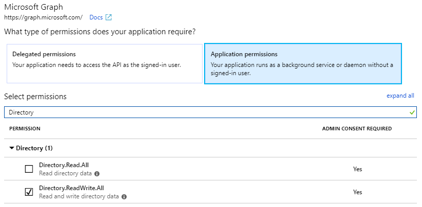
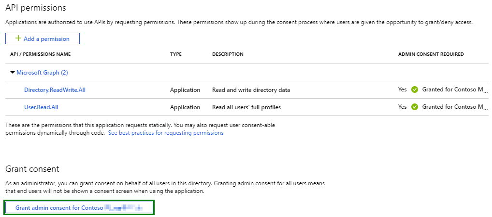

# Day 17 - Assign Office 365 User License

- [Day 17 - Assign Office 365 User License](#day-17---assign-office-365-user-license)
  - [Prerequisites](#prerequisites)
  - [Step 1: Update the App Registration permissions](#step-1-update-the-app-registration-permissions)
  - [Step 2: Extend the app to Office 365 Licensing](#step-2-extend-the-app-to-office-365-licensing)
    - [Create the LicenseHelper class](#create-the-licensehelper-class)
    - [Extend program to assing a license to a user](#extend-program-to-assing-a-license-to-a-user)

## Prerequisites

To complete this sample you need the following:

- Complete the [Base Console Application Setup](../base-console-app/)
- [Visual Studio Code](https://code.visualstudio.com/) installed on your development machine. If you do not have Visual Studio Code, visit the previous link for download options. (**Note:** This tutorial was written with Visual Studio Code version 1.28.2. The steps in this guide may work with other versions, but that has not been tested.)
- [.Net Core SDK](https://www.microsoft.com/net/download/dotnet-core/2.1#sdk-2.1.403). (**Note** This tutorial was written with .Net Core SDK 2.1.403.  The steps in this guide may work with other versions, but that has not been tested.)
- [C# extension for Visual Studio Code](https://marketplace.visualstudio.com/items?itemName=ms-vscode.csharp)
- Either a personal Microsoft account with a mailbox on Outlook.com, or a Microsoft work or school account.

If you don't have a Microsoft account, there are a couple of options to get a free account:

- You can [sign up for a new personal Microsoft account](https://signup.live.com/signup?wa=wsignin1.0&rpsnv=12&ct=1454618383&rver=6.4.6456.0&wp=MBI_SSL_SHARED&wreply=https://mail.live.com/default.aspx&id=64855&cbcxt=mai&bk=1454618383&uiflavor=web&uaid=b213a65b4fdc484382b6622b3ecaa547&mkt=E-US&lc=1033&lic=1).
- You can [sign up for the Office 365 Developer Program](https://developer.microsoft.com/office/dev-program) to get a free Office 365 subscription.

## Step 1: Update the App Registration permissions

As this exercise requires new permissions the App Registration needs to be updated to include the Directory.ReadWrite.All application permission using the new Azure AD Portal App Registrations UI (in preview as of the time of publish Nov 2018).

1. Open a browser and navigate to the [Azure AD Portal](https://go.microsoft.com/fwlink/?linkid=2083908) app registrations page. Login using a **personal account** (aka: Microsoft Account) or **Work or School Account** with permissions to create app registrations.

    > **Note:** If you do not have permissions to create app registrations contact your Azure AD domain administrators.

1. Click on the **.NET Core Graph Tutorial** item in the list

    > **Note:** If you used a different name while completing the [Base Console Application Setup](../base-console-app/) select that instead.

1. Click **API permissions** from the current blade content.

    1. Click **Add a permission** from the current blade content.
    1. On the **Request API permissions** flyout select **Microsoft Graph**.

        

    1. Select **Application permissions**.
    1. In the "Select permissions" search box type "Directory".
    1. Select **Directory.ReadWrite.All** from the filtered list.

        

    1. Click **Add permissions** at the bottom of flyout.

1. Back on the API permissions content blade, click **Grant admin consent for \<name of tenant\>**.

    

    1. Click **Yes**.

## Step 2: Extend the app to Office 365 Licensing

In this step you will create a LicenseHelper class that encapsulates the logic for creating users and finding user objects by alias and then add calls to the console application created in the [Base Console Application Setup](../base-console-app/) to provision a new user.

### Create the LicenseHelper class

1. Create a new file in the `Helpers` folder called `LicenseHelper.cs`.
1. Replace the contents of `LicenseHelper.cs` with the following code:

    ```cs
    using System;
    using System.Collections.Generic;
    using System.Threading.Tasks;
    using Microsoft.Graph;

    namespace ConsoleGraphTest
    {
        public class LicenseHelper
        {
            private GraphServiceClient _graphClient;

            public LicenseHelper(GraphServiceClient graphClient)
            {
                if (null == graphClient) throw new ArgumentNullException(nameof(graphClient));
                _graphClient = graphClient;
            }

            public async Task<User> GetUser(string UPN)
            {
                var user = await _graphClient.Users[UPN].Request().GetAsync();
                return user;
            }

            public async Task<SubscribedSku> GetLicense()
            {
                var skuResult = await _graphClient.SubscribedSkus.Request().GetAsync();
                return skuResult[0];
            }

            public async Task AddLicense(string userId, Guid? skuId)
            {
                var licensesToAdd = new List<AssignedLicense>();
                var licensesToRemove = new List<Guid>();

                var license = new AssignedLicense()
                {
                    SkuId = skuId,
                };

                licensesToAdd.Add(license);

                await _graphClient.Users[userId].AssignLicense(licensesToAdd, licensesToRemove).Request().PostAsync();
            }
        }
    }
    ```

This class contains the code to get a user, get a license, and assign the license to user.

### Extend program to assing a license to a user

1. Inside the `Program` class add a new method `AddLicenseToUser` with the following definition.  This method adds an Office 365 license to a user using the LicenseHelper class.

    ```cs
        private static void AddLicenseToUser(IConfigurationRoot config)
        {
            string alias = "<replaceWithUserAlias>";
            string domain = config["domain"];
            string upn = $"{alias}@{domain}";
            var licenseHelper = new LicenseHelper(_graphServiceClient);
            var user = licenseHelper.GetUser(upn).Result;

            var sku = licenseHelper.GetLicense().Result;
            licenseHelper.AddLicense(user.Id, sku.SkuId).GetAwaiter().GetResult();
        }
    ```

    > **Important** Please update the `<replaceWithUserAlias>` with a user name alias from your tenant.  Ex. "AdeleV".

1. Continuing in the `Main` method add the following code to call the new method.

    ```cs
    AddLicenseToUser(config);
    ```

1. Save all files.

The console application is now able to assign a user license. In order to test the console application run the following commands from the command line:

    ```
    dotnet build
    dotnet run
    ```
