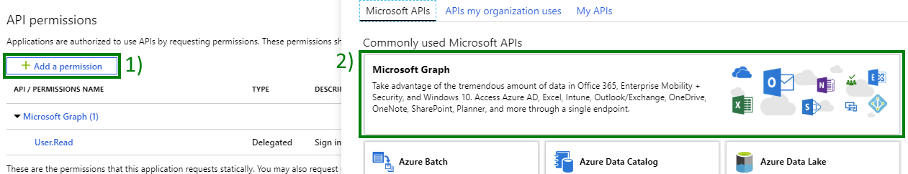
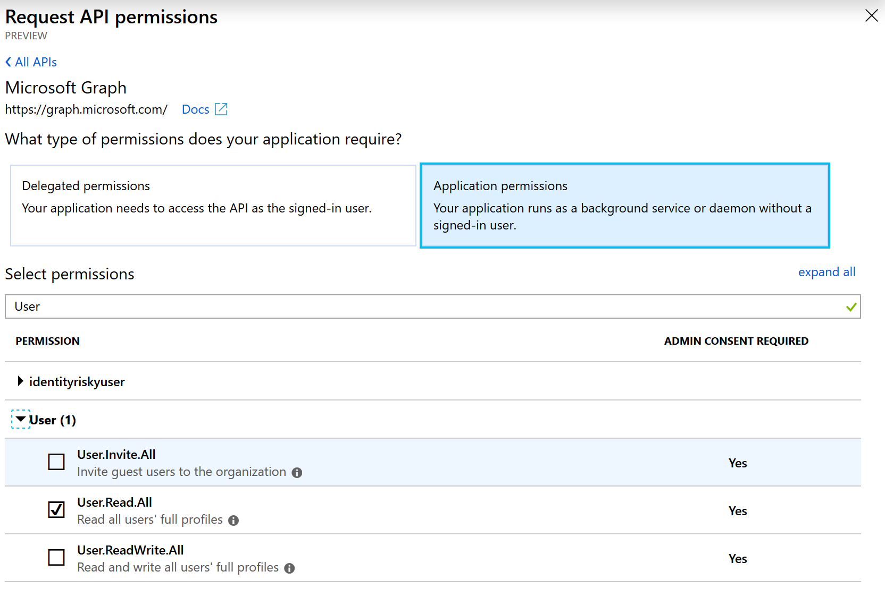
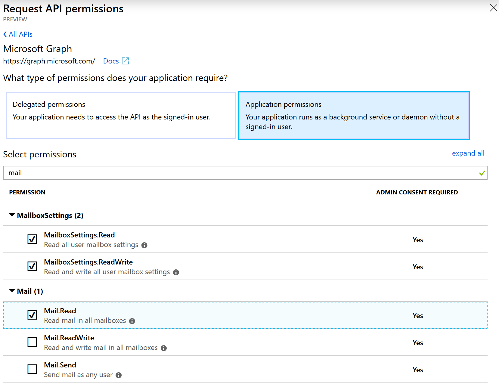
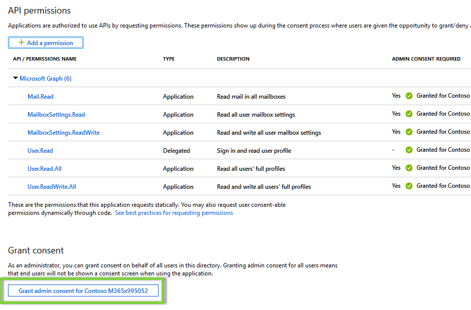

# Day 18 - Manage and Update user mailbox settings

- [Day 18 - Manage and Update user mailbox settings](#day-18---manage-and-update-user-mailbox-settings)
  - [Prerequisites](#prerequisites)
  - [Step 1: Update the App Registration permissions](#step-1-update-the-app-registration-permissions)
  - [Step 2: Extend the app to manage and update user mailbox](#step-2-extend-the-app-to-manage-and-update-user-mailbox)
    - [Create the MailboxHelper class](#create-the-mailboxhelper-class)
    - [Extend program to read and update mailbox settings](#extend-program-to-read-and-update-mailbox-settings)
    - [Extend program to create and retrieve message rules](#extend-program-to-create-and-retrieve-message-rules)

## Prerequisites

To complete this sample you need the following:

- Complete the [Base Console Application Setup](../base-console-app/)
- [Visual Studio Code](https://code.visualstudio.com/) installed on your development machine. If you do not have Visual Studio Code, visit the previous link for download options. (**Note:** This tutorial was written with Visual Studio Code version 1.28.2. The steps in this guide may work with other versions, but that has not been tested.)
- [.Net Core SDK](https://www.microsoft.com/net/download/dotnet-core/2.1#sdk-2.1.403). (**Note** This tutorial was written with .Net Core SDK 2.1.403.  The steps in this guide may work with other versions, but that has not been tested.)
- [C# extension for Visual Studio Code](https://marketplace.visualstudio.com/items?itemName=ms-vscode.csharp)
- Either a personal Microsoft account with a mailbox on Outlook.com, or a Microsoft work or school account.

If you don't have a Microsoft account, there are a couple of options to get a free account:

- You can [sign up for a new personal Microsoft account](https://signup.live.com/signup?wa=wsignin1.0&rpsnv=12&ct=1454618383&rver=6.4.6456.0&wp=MBI_SSL_SHARED&wreply=https://mail.live.com/default.aspx&id=64855&cbcxt=mai&bk=1454618383&uiflavor=web&uaid=b213a65b4fdc484382b6622b3ecaa547&mkt=E-US&lc=1033&lic=1).
- You can [sign up for the Office 365 Developer Program](https://developer.microsoft.com/office/dev-program) to get a free Office 365 subscription.

## Step 1: Update the App Registration permissions

As this exercise requires new permissions the App Registration needs to be updated to include the **User.Read.All**, **Mail.Read**, **MailboxSettings.Read** and **MailboxSettings.ReadWrite** permissions using the new Azure AD Portal App Registrations UI (in preview as of the time of publish Nov 2018).

1. Open a browser and navigate to the [Azure AD Portal](https://go.microsoft.com/fwlink/?linkid=2083908) app registrations page. Login using a **personal account** (aka: Microsoft Account) or **Work or School Account** with permissions to create app registrations.

    > **Note:** If you do not have permissions to create app registrations contact your Azure AD domain administrators.

1. Click on the **.NET Core Graph Tutorial** item in the list

    > **Note:** If you used a different name while completing the [Base Console Application Setup](../base-console-app/) select that instead.

1. Click **API permissions** from the current blade content.

    1. Click **Add a permission** from the current blade content.
    1. On the **Request API permissions** flyout select **Microsoft Graph**.

        

    1. Select **Application permissions**.
    1. In the "Select permissions" search box type "User".
    1. Select **User.Read.All** from the filtered list.

        
    1. In the "Select permissions" search box type "Mail".
    1. Select **Mail.Read**, **MailboxSettings.Read** and **MailboxSettings.ReadWrite** from the filtered list.

        

    1. Click **Add permissions** at the bottom of flyout.

1. Back on the API permissions content blade, click **Grant admin consent for Contoso**.
    

    1. Click **Yes**.

## Step 2: Extend the app to manage and update user mailbox

In this step you will create a MailboxHelper class that encapsulates the logic for creating new mailbox message rules, read mail and mailboxsettings along with finding user objects by alias. Then add methods to the console application created in the [Base Console Application Setup](../base-console-app/) to create message rule, read mail and mailbox settings.

### Create the MailboxHelper class

1. Create a new file in the `Helpers` folder called `ResultsItems.cs`.
1. Replace the contents of `ResultsItems.cs` with the following code:

    ```cs
    using System;
    using System.Collections.Generic;
    using System.Net.Http;
    using System.Threading.Tasks;
    using Microsoft.Graph;

    namespace ConsoleGraphTest
    {
        public class ResultsItem
        {

            // The ID and display name for the entity's radio button.
            public string Id { get; set; }
            public string Display { get; set; }

            // The properties of an entity that display in the UI.
            public Dictionary<string, object> Properties;

            public ResultsItem()
            {
                Properties = new Dictionary<string, object>();
            }
        }
    }
    ```

This class contains the helper class that will be used to hold the result data from various Microsoft Graph API calls and then used to iterate (if applicable) and show it in UI.

1. Create a new file in the `Helpers` folder called `MailboxHelper.cs`.
1. Replace the contents of `MailboxHelper.cs` with the following code:

    ```cs
    using System;
    using System.Collections.Generic;
    using System.Net.Http;
    using System.Threading.Tasks;
    using Microsoft.Graph;

    namespace ConsoleGraphTest
    {
        public class MailboxHelper
        {
            private GraphServiceClient _graphClient;
            private HttpClient _httpClient;
            public MailboxHelper(GraphServiceClient graphClient)
            {
                if (null == graphClient) throw new ArgumentNullException(nameof(graphClient));
                    _graphClient = graphClient;
            }
            public MailboxHelper(HttpClient httpClient)
            {
                if (null == httpClient) throw new ArgumentNullException(nameof(httpClient));
                    _httpClient = httpClient;
            }

            public MailboxHelper(GraphServiceClient graphClient, HttpClient httpClient)
            {
                if (null == graphClient) throw new ArgumentNullException(nameof(graphClient));
                    _graphClient = graphClient;
                if (null == httpClient) throw new ArgumentNullException(nameof(httpClient));
                    _httpClient = httpClient;
            }

            public async Task<List<ResultsItem>> ListInboxMessages(string alias)
            {
                User user = FindByAlias(alias).Result;
                List<ResultsItem> items = new List<ResultsItem>();

                IMailFolderMessagesCollectionPage messages = await _graphClient.Users[user.Id].MailFolders.Inbox.Messages.Request().Top(10).GetAsync();
                if (messages?.Count > 0)
                {
                    foreach (Message message in messages)
                    {
                        items.Add(new ResultsItem
                        {
                            Display = message.Subject,
                            Id = message.Id
                        });
                    }
                }
                return items;
            }
            public async Task<string> GetUserMailboxDefaultTimeZone(string alias)
            {
                User user = FindByAlias(alias).Result;
                User detailedUser = await _graphClient.Users[user.Id].Request().Select("MailboxSettings").GetAsync();
                return detailedUser.MailboxSettings.TimeZone;
            }
            public async void SetUserMailboxDefaultTimeZone(string alias, string timezone)
            {
                User user = FindByAlias(alias).Result;
                Uri Uri = new Uri("https://graph.microsoft.com/v1.0/users/"+ user.Id +"/mailboxSettings");
                String jsonContent = "{\"timeZone\" : \""+ timezone +"\"}";
                HttpContent httpContent = new StringContent(jsonContent, System.Text.Encoding.UTF8, "application/json");
                await _httpClient.PatchAsync(Uri, httpContent);
            }

            public async Task<List<ResultsItem>> GetUserMailboxRules(string alias)
            {
                User user = FindByAlias(alias).Result;
                IMailFolderMessageRulesCollectionPage rules = await _graphClient.Users[user.Id].MailFolders.Inbox.MessageRules.Request().GetAsync(); 
                List<ResultsItem> items = new List<ResultsItem>();
                if (rules?.Count > 0)
                {
                    foreach (MessageRule rule in rules)
                    {
                        items.Add(new ResultsItem
                        {
                            Display = rule.DisplayName,
                            Id = rule.Id
                        });
                    }
                }
                return items;
            }
            public async Task CreateRule(string alias, string displayName, int sequence, bool isEnabled, string senderContains, string forwardToEmail)
            {
                MessageRule rule = BuildMailRule(displayName, sequence, isEnabled, senderContains, forwardToEmail);
                User user = FindByAlias(alias).Result;
                await _graphClient.Users[user.Id].MailFolders.Inbox.MessageRules.Request().AddAsync(rule);
            }
            public async Task<User> FindByAlias(string alias)
            {
                List<QueryOption> queryOptions = new List<QueryOption>
                {
                    new QueryOption("$filter", $@"mailNickname eq '{alias}'")
                };

                var userResult = await _graphClient.Users.Request(queryOptions).GetAsync();
                if (userResult.Count != 1) throw new ApplicationException($"Unable to find a user with the alias {alias}");
                return userResult[0];
            }

            private static MessageRule BuildMailRule(string displayName, int sequence, bool isEnabled, string senderContains, string forwardToEmail)
            {
                IEnumerable<string> senderContainsList = new string[]{senderContains};
                EmailAddress email = new EmailAddress(){
                    Address = forwardToEmail
                };
                Recipient recipient = new Recipient(){
                    EmailAddress = email
                };
                IEnumerable<Recipient> recipientList = new Recipient[]{ recipient };
                var msgRule = new MessageRule{
                    DisplayName = displayName,
                    Sequence = sequence,
                    IsEnabled = isEnabled,
                    Conditions = new MessageRulePredicates{
                        SenderContains = senderContainsList
                    },
                    Actions = new MessageRuleActions{
                        ForwardTo = recipientList
                    }
                };
                return msgRule;
            }
        }
    }
    ```

This class contains the code to read and update mailbox settings, create user mailbox message rules, retrieve the message rules, retrieve the mailbox messages.

### Extend program to read and update mailbox settings

1. Inside the `Program` class add below methods. The `GetUserMailboxDefaultTimeZone` method will retrieve the user mailbox settings (in this case it outputs the default timezone). The `SetUserMailboxDefaultTimeZone` method will update the user mailbox settings (in this case it updates the default timezone). The method `ListUserMailInboxMessages` is added to showcase how MS Graph SDK can be used to retrieve user mailbox messages. 

    ```cs
    private static void GetUserMailboxDefaultTimeZone()
    {
        const string alias = "admin";
        var mailboxHelper = new MailboxHelper(_graphServiceClient);
        var defaultTimeZone = mailboxHelper.GetUserMailboxDefaultTimeZone(alias).Result;
        Console.WriteLine("Default timezone: "+ defaultTimeZone);
    }
    private static void SetUserMailboxDefaultTimeZone()
    {
        const string alias = "admin";
        var mailboxHelper = new MailboxHelper(_graphServiceClient, _httpClient);
        mailboxHelper.SetUserMailboxDefaultTimeZone(alias, "Eastern Standard Time");
    }
    private static void ListUserMailInboxMessages()
    {
        const string alias = "admin";
        var mailboxHelper = new MailboxHelper(_graphServiceClient);
        List<ResultsItem> items = mailboxHelper.ListInboxMessages(alias).Result;
        Console.WriteLine("Message count: "+ items.Count);
    }
    ```

1. Continuing in the `Main` method add the following code to call the new method.

    ```cs
    //Get the current timezone setting
    GetUserMailboxDefaultTimeZone();
    //update the timezone setting for the user mailbox
    SetUserMailboxDefaultTimeZone();
    //Get the timezone setting again to verify that its updated
    GetUserMailboxDefaultTimeZone();

    //Showcase method to show how to MS Graph sdk to retrieve messages
    ListUserMailInboxMessages();
    ```

1. Save all files.

>**Note:** Currently (as of Nov 2018) there is no support to update mailbox settings in MS Graph SDK. However, its in the works and expect to have that update soon. This sample will be updated accordingly. The method `SetUserMailboxDefaultTimeZone` uses HTTPClient instead of GraphServiceClient object to update the mailbox settings.

The console application is now able to retrieve and update the mailbox settings and get mailbox messages. In order to test the console application run the following commands from the command line:

```
dotnet build
dotnet run
```

### Extend program to create and retrieve message rules

1. Inside the `Program` class add below methods. The `ListUserMailBoxRules` method will retrieve the user mailbox message rules. The `CreateUserMailBoxRule` method will create a new message rule for the user mailbox witht the supplied parameters: rule displayname, sequence, enabled or not, filter criteria for sender and forward mail to email. 

    ```cs
    private static void ListUserMailBoxRules()
    {
        const string alias = "admin";
        var mailboxHelper = new MailboxHelper(_graphServiceClient);
        List<ResultsItem> rules = mailboxHelper.GetUserMailboxRules(alias).Result;
        Console.WriteLine("Rules count: "+ rules.Count);
        foreach(ResultsItem rule in rules)
        {
            Console.WriteLine("Rule Name: "+ rule.Display);
        }
    }

    private static void CreateUserMailBoxRule()
    {
        const string alias = "admin";
        var mailboxHelper = new MailboxHelper(_graphServiceClient);
        mailboxHelper.CreateRule(alias, "ForwardBasedonSender", 2, true, "svarukal", "adelev@M365x995052.onmicrosoft.com").GetAwaiter().GetResult();
    }
    ```

1. Continuing in the `Main` method add the following code to call the new method.

    ```cs
    //Create a new message rule
    CreateUserMailBoxRule();
    //Retrieve the message rules to validate
    ListUserMailBoxRules();
    ```

1. Save all files.

The console application is now able to create a new message rule and then retrieve all the message rules for the user. In order to test the console application run the following commands from the command line:

```
dotnet build
dotnet run
```

After running this you have updated the user mailbox settings along with creating a message rule for the user.