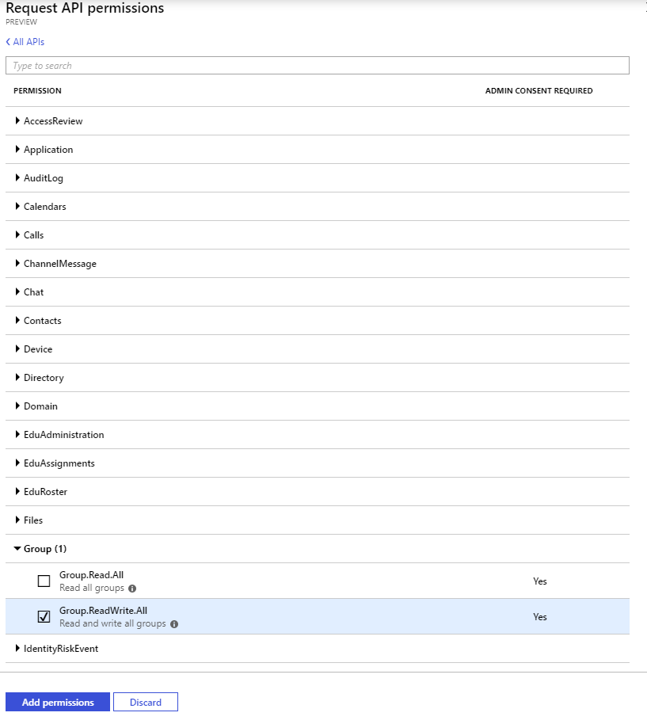
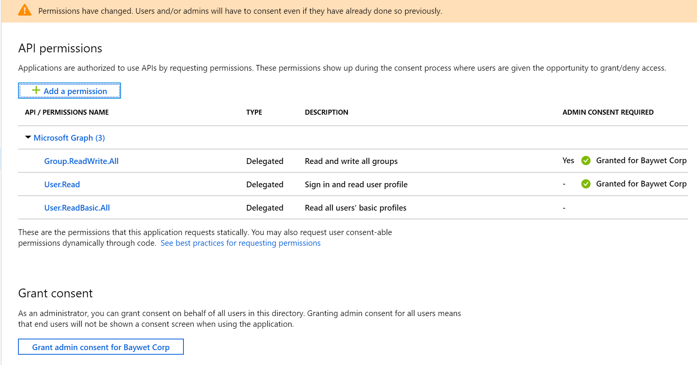

# Day 21 - Creating plans, buckets, and tasks in Planner

- [Day 21 - Creating plans, buckets, and tasks in Planner](#day-21---creating-plans-buckets-and-tasks-in-planner)
  - [Prerequisites](#prerequisites)
  - [Step 1: Update the App Registration permissions](#step-1-update-the-app-registration-permissions)
  - [Step 2: Ensure that you are part of an Office 365 group](#step-2-ensure-that-you-are-part-of-an-office-365-group)
  - [Step 3: Enable your application for Device Code Flow](#step-3-enable-your-application-for-device-code-flow)
  - [Step 4: Extend the app to List existing Planner Plans](#step-4-extend-the-app-to-list-existing-planner-plans)
    - [Extend program to List existing Planner Plans](#extend-program-to-list-existing-planner-plans)
    - [Extend program to add a Bucket](#extend-program-to-add-a-bucket)
    - [Extend program to add a Task](#extend-program-to-add-a-task)

## Prerequisites

To complete this sample you need the following:

- Complete the [Base Console Application Setup](../base-console-app/)
- Complete the [Day 20 - Device Code Auth Setup](../day20-devicecode)
- [Visual Studio Code](https://code.visualstudio.com/) installed on your development machine. If you do not have Visual Studio Code, visit the previous link for download options. (**Note:** This tutorial was written with Visual Studio Code version 1.28.2. The steps in this guide may work with other versions, but that has not been tested.)
- [.Net Core SDK](https://www.microsoft.com/net/download/dotnet-core/2.1#sdk-2.1.403). (**Note** This tutorial was written with .Net Core SDK 2.1.403.  The steps in this guide may work with other versions, but that has not been tested.)
- [C# extension for Visual Studio Code](https://marketplace.visualstudio.com/items?itemName=ms-vscode.csharp)
- Either a personal Microsoft account with a mailbox on Outlook.com, or a Microsoft work or school account.

If you don't have a Microsoft account, there are a couple of options to get a free account:

- You can [sign up for a new personal Microsoft account](https://signup.live.com/signup?wa=wsignin1.0&rpsnv=12&ct=1454618383&rver=6.4.6456.0&wp=MBI_SSL_SHARED&wreply=https://mail.live.com/default.aspx&id=64855&cbcxt=mai&bk=1454618383&uiflavor=web&uaid=b213a65b4fdc484382b6622b3ecaa547&mkt=E-US&lc=1033&lic=1).
- You can [sign up for the Office 365 Developer Program](https://developer.microsoft.com/office/dev-program) to get a free Office 365 subscription.

## Step 1: Update the App Registration permissions

As this exercise requires new permissions the App Registration needs to be updated to include the **Group.ReadWrite.All** and **User.ReadBasic.All** permissions using the new Azure AD Portal App Registrations UI (in preview as of the time of publish Nov 2018).

1. Open a browser and navigate to the [Azure AD Portal](https://go.microsoft.com/fwlink/?linkid=2083908) app registrations page. Login using a **personal account** (aka: Microsoft Account) or **Work or School Account** with permissions to create app registrations.

    > **Note:** If you do not have permissions to create app registrations contact your Azure AD domain administrators.

1. Click on the **.NET Core Graph Tutorial** item in the list

    > **Note:** If you used a different name while completing the [Base Console Application Setup](../base-console-app/) select that instead.

1. Click **API permissions** from the current blade content.

    1. Click **Add a permission** from the current blade content.
    1. On the **Request API permissions** flyout select **Microsoft Graph**.

        

    1. Select **Delegated permissions**.
    1. In the "Select permissions" search box type "\<Start of permission string\>".
    1. Select **Group.ReadWrite.All** from the filtered list.

        

    1. Selection **User.ReadBasic.All** from the filtered list.
        

    1. Click **Add permissions** at the bottom of flyout.

1. Back on the API permissions content blade, click **Grant admin consent for \<name of tenant\>**.  

    

    1. Click **Yes**.

    > **Note:** Make sure you do not have any application permission already selected, it will make the request fail. If you do have some, remove them before granting the new permissions.

## Step 2: Ensure that you are part of an Office 365 group

Planner relies on the Office 365 group infrastructure to function properly. Please make sure you [create a group](https://support.office.com/en-us/article/Create-a-group-in-Outlook-04d0c9cf-6864-423c-a380-4fa858f27102).

## Step 3: Enable your application for Device Code Flow

1. On the application registration view from the last step, click on **Manifest**.
1. Set the `allowPublicClient` property to `true`.
1. Click on `Save`

## Step 4: Extend the app to List existing Planner Plans

In this step you will create a Helper method that encapsulates the logic for listing existing plans and then add calls to the console application created in the [Device Code Flow](../day20-devicecode/).

 > **Important:** Ensure that you follow the steps from Day 20 Device Code Flow exercise or today's application updates will not leverage the proper authentication flow necessary to be successful.

### Extend program to List existing Planner Plans

1. Inside the `Program` class update the method `Main` with the following definition.  This method will leverage a Helper we will create next

    ```cs
    static void Main(string[] args)
    {
        // Load appsettings.json
        var config = LoadAppSettings();
        if (null == config)
        {
            Console.WriteLine("Missing or invalid appsettings.json file. Please see README.md for configuration instructions.");
            return;
        }

        var GraphServiceClient = GetAuthenticatedGraphClient(config);
        var plannerHelper = new PlannerHelper(GraphServiceClient);
        plannerHelper.PlannerHelperCall().GetAwaiter().GetResult();
    }
    ```

1. Inside the `Helpers` folder add a class `PlannerHelper.cs` with the following definition.

    We will build on this class during the exercise.
    As it is defined, the helper will list current plans for the first group it can find, and create one if none exist.

    ```cs
    using System;
    using System.Collections.Generic;
    using System.Linq;
    using System.Threading.Tasks;
    using Microsoft.Graph;

    namespace ConsoleGraphTest
    {
        public class PlannerHelper
        {
            private readonly GraphServiceClient _graphClient;
            public PlannerHelper(GraphServiceClient graphClient)
            {
                _graphClient = graphClient ?? throw new ArgumentNullException(nameof(graphClient));
            }
            public async Task PlannerHelperCall()
            {
                //Getting the first group we can find to create a plan
                var groupId = (await _graphClient.Me.GetMemberGroups(false).Request().PostAsync()).FirstOrDefault();

                if (groupId != null)
                {
                    var users = await _graphClient.Users.Request(new List<QueryOption> {
                            new QueryOption("$top", "3")
                        }).GetAsync();

                    var planId = await GetAndListCurrentPlans(groupId) ?? await CreatePlannerPlan(users, groupId);
                }
            }
            private async Task<string> GetAndListCurrentPlans(string groupId)
            {
                //Querying plans in current group
                var plans = await _graphClient.Groups[groupId].Planner.Plans.Request(new List<QueryOption>
                {
                    new QueryOption("$orderby", "Title asc")
                }).GetAsync();
                if (plans.Any())
                {
                    Console.WriteLine($"Number of plans in current tenant: {plans.Count}");
                    Console.WriteLine(plans.Select(x => $"-- {x.Title}").Aggregate((x, y) => $"{x}\n{y}"));
                    return plans.First().Id;
                }
                else
                {
                    Console.WriteLine("No existing plan");
                    return null;
                }
            }
            private async Task<string> CreatePlannerPlan(IEnumerable<User> users, string groupId)
            {
                // Getting users to share the plan with
                var sharedWith = new PlannerUserIds();
                users.ToList().ForEach(x => sharedWith.Add(x.Id));

                // Creating a new planner plan
                var createdPlan = await _graphClient.Planner.Plans.Request().AddAsync(
                    new PlannerPlan
                    {
                        Title = $"My new Plan {Guid.NewGuid().ToString()}",
                        Owner = groupId,
                        Details = new PlannerPlanDetails
                        {
                            SharedWith = sharedWith,
                            CategoryDescriptions = new PlannerCategoryDescriptions
                            {
                                Category1 = "my first category",
                                Category2 = "my second category"
                            },
                        }
                    }
                );
                Console.WriteLine($"Added a new plan {createdPlan.Id}");
                return createdPlan.Id;
            }
        }
    }
    ```

1. Save all files.

The console application is now able to list the plans in the group and create one if none exist. In order to test the console application run the following commands from the command line:

```
dotnet build
dotnet run
```

### Extend program to add a Bucket

1. Inside the `PlannerHelper` class add a new method `CreatePlannerBucket` with the following definition. This method adds a new bucket to a plan.

    ```cs
    private async Task<string> CreatePlannerBucket(string groupId, string planId)
    {
        // Creating a new bucket within the plan
        var createdBucket = await _graphClient.Planner.Buckets.Request().AddAsync(
            new PlannerBucket
            {
                Name = "my first bucket",
                OrderHint = " !",
                PlanId = planId
            }
        );
        Console.WriteLine($"Added new bucket {createdBucket.Name} to plan");
        return createdBucket.Id;
    }
    ```

1. Inside the `PlannerHelper` add the following line at the end of the `PlannerHelperCall` method.

    ```cs
    var bucketId = await CreatePlannerBucket(groupId, planId);
    ```

1. Save all files.

The console application is now able add new buckets to a plan. In order to test the console application run the following commands from the command line:

```
dotnet build
dotnet run
```

### Extend program to add a Task

1. Inside the `PlannerHelper` class add a new method `CreatePlannerTask` with the following definition. This method adds a new task to a bucket.

    ```cs
    private async Task CreatePlannerTask(IEnumerable<User> users, string groupId, string planId, string bucketId)
    {
        // Preparing the assignment for the task
        var assignments = new PlannerAssignments();
        users.ToList().ForEach(x => assignments.AddAssignee(x.Id));
        // Creating a task within the bucket
        var createdTask = await _graphClient.Planner.Tasks.Request().AddAsync(
            new PlannerTask
            {
                DueDateTime = DateTimeOffset.UtcNow.AddDays(7),
                Title = "Do the dishes",
                Details = new PlannerTaskDetails
                {
                    Description = "Do the dishes that are remaining in the sink"
                },
                Assignments = assignments,
                PlanId = planId,
                BucketId = bucketId
            }
        );
        Console.WriteLine($"Added new task {createdTask.Title} to bucket");
    }
    ```

1. Inside the `PlannerHelper` class update the `PlannerHelperCall` method to add the following line at the end.

    ```cs
    await CreatePlannerTask(users, groupId, planId, bucketId);
    ```

1. Save all files.

The console application is now able add new tasks to a bucket. In order to test the console application run the following commands from the command line:

```
dotnet build
dotnet run
```
