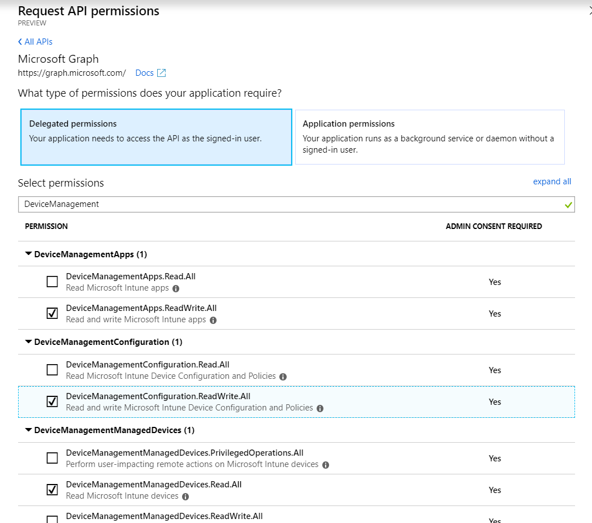
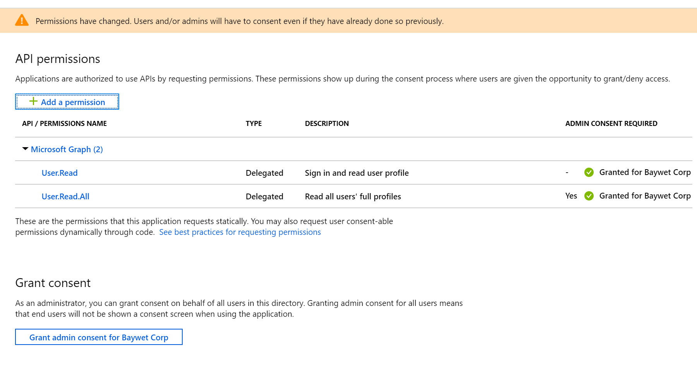

# Day 22 - Device and App Management with Intune

- [Day 22 - Device and App Management with Intune](#day-22---device-and-app-management-with-intune)
  - [Prerequisites](#prerequisites)
  - [Step 1: Update the App Registration permissions](#step-1-update-the-app-registration-permissions)
  - [Step 2: Extend the application with IntuneHelper class](#step-2-extend-the-application-with-intunehelper-class)
  - [Step 3: Extend the Program to list Managed Devices for a User](#step-3-extend-the-program-to-list-managed-devices-for-a-user)
  - [Step 4: Extend the program to publish a web app](#step-4-extend-the-program-to-publish-a-web-app)
  - [Step 5: Extend the program to assign an app to all users](#step-5-extend-the-program-to-assign-an-app-to-all-users)
  - [Step 6: Extend the program to create a Device Configuration Policy](#step-6-extend-the-program-to-create-a-device-configuration-policy)
  - [Step 7: Extend the program to assign a Device Configuration Policy to all devices](#step-7-extend-the-program-to-assign-a-device-configuration-policy-to-all-devices)


## Prerequisites

To complete this sample you need the following:

- Complete the [Base Console Application Setup](../base-console-app/)
- [Visual Studio Code](https://code.visualstudio.com/) installed on your development machine. If you do not have Visual Studio Code, visit the previous link for download options. (**Note:** This tutorial was written with Visual Studio Code version 1.28.2. The steps in this guide may work with other versions, but that has not been tested.)
- [.Net Core SDK](https://www.microsoft.com/net/download/dotnet-core/2.1#sdk-2.1.403). (**Note** This tutorial was written with .Net Core SDK 2.1.403.  The steps in this guide may work with other versions, but that has not been tested.)
- [C# extension for Visual Studio Code](https://marketplace.visualstudio.com/items?itemName=ms-vscode.csharp)
- A Microsoft work or school account.
- An Intune subscription, if you don't have an Intune subscription [Create a free trial](https://docs.microsoft.com/en-us/intune/get-started-evaluation)

If you don't have a Microsoft account you can [sign up for the Office 365 Developer Program](https://developer.microsoft.com/office/dev-program) to get a free Office 365 subscription.

## Step 1: Update the App Registration permissions

As this exercise requires new permissions the App Registration needs to be updated to include the **DeviceManagementApps.ReadWrite.All)**, **DeviceManagementConfiguration.ReadWrite.All**, and **DeviceManagementManagedDevices.Read.All** permissions using the new Azure AD Portal App Registrations UI (in preview as of the time of publish Nov 2018).

1. Open a browser and navigate to the [Azure AD Portal](https://go.microsoft.com/fwlink/?linkid=2083908) app registrations page. Login using a **personal account** (aka: Microsoft Account) or **Work or School Account** with permissions to create app registrations.

    > **Note:** If you do not have permissions to create app registrations contact your Azure AD domain administrators.

1. Click on the **.NET Core Graph Tutorial** item in the list

    > **Note:** If you used a different name while completing the [Base Console Application Setup](../base-console-app/) select that instead.

1. Click **API permissions** from the current blade content.

    1. Click **Add a permission** from the current blade content.
    1. On the **Request API permissions** flyout select **Microsoft Graph**.

        

    1. Select **Delegated permissions**.
    1. In the "Select permissions" search box type "DeviceManagement>".
    1. Select **DeviceManagementApps.ReadWrite.All**, **DeviceManagementConfiguration.ReadWrite.All**, and **DeviceManagementManagedDevices.Read.All** from the filtered list.

        

    1. Click **Add permissions** at the bottom of flyout.

1. Back on the API permissions content blade, click **Grant admin consent for \<name of tenant\>**.  
    

    1. Click **Yes**.  

    > **Note:** Make sure you do not have any application permission already selected, it will make the request fail. If you do have some, remove them before granting the new permissions.

## Step 2: Extend the application with IntuneHelper class

In this step you will create a Helper method that encapsulates the logic for interacting with Intune and then add calls to the console application created in the [Device Code Flow](../day20-devicecode/).

 > **Important:** Ensure that you follow the steps from Day 20 Device Code Flow exercise or today's application updates will not leverage the proper authentication flow necessary to be successful.

1. Create a new file in the `Helpers` folder called `IntuneHelper.cs`.
1. Replace the contents of `IntuneHelper.cs` with the following code:

    ```cs
    using System;
    using System.Collections.Generic;
    using System.Threading.Tasks;
    using Microsoft.Graph;

    namespace ConsoleGraphTest
    {
        public class IntuneHelper
        {
            private GraphServiceClient _graphClient;

            public IntuneHelper(GraphServiceClient graphClient)
            {
                if (null == graphClient) throw new ArgumentNullException(nameof(graphClient));
                _graphClient = graphClient;
            }

            /// <summary>
            /// Get the list of Intune managed devices for a user.
            /// </summary>
            /// <param name="userPrincipalName">The user principal name (UPN) for the user</param>
            /// <returns>The Intune managed devices.</returns>
            public async Task<ICollection<ManagedDevice>> ListManagedDevicesForUser(string userPrincipalName)
            {
                List<ManagedDevice> managedDevices = new List<ManagedDevice>();
                List<QueryOption> queryOptions = new List<QueryOption>
                {
                    new QueryOption("$orderby", "deviceName")
                };

                var deviceResults = await _graphClient.Users[userPrincipalName].ManagedDevices.Request(queryOptions).GetAsync();

                managedDevices.AddRange(deviceResults.CurrentPage);

                // Page through the results in case there are more than one page of devices.
                while (deviceResults.NextPageRequest != null)
                {
                    deviceResults = await deviceResults.NextPageRequest.GetAsync();
                    managedDevices.AddRange(deviceResults.CurrentPage);
                }

                return managedDevices;
            }

            /// <summary>
            /// Publish a web app to Intune
            /// </summary>
            /// <param name="url">The url for the website</param>
            /// <param name="name">The name of the website</param>
            /// <param name="publisher">The name of the publisher</param>
            /// <returns>The created app</returns>
            public async Task<WebApp> PublishWebApp(string url, string name, string publisher)
            {
                var webApp = new WebApp
                {
                    AppUrl = url,
                    DisplayName = name,
                    Publisher = publisher
                };

                return await _graphClient.DeviceAppManagement.MobileApps.Request().AddAsync(webApp) as WebApp;
            }

            /// <summary>
            /// Assign an Intune MobileApp to all users.
            /// </summary>
            /// <param name="app">The application to assign.</param>
            /// <returns>The assignements for the app.</returns>
            public async Task<ICollection<MobileAppAssignment>> AssignAppToAllUsers(MobileApp app)
            {
                var assignment = BuildMobileAppAssignment();

                await _graphClient.DeviceAppManagement.MobileApps[app.Id].Assign(new[] { assignment }).Request().PostAsync();

                return await _graphClient.DeviceAppManagement.MobileApps[app.Id].Assignments.Request().GetAsync();
            }

            /// <summary>
            /// Create a Windows 10 Device Configuration in Intune
            /// </summary>
            /// <param name="displayName">The display name of the device configuration.</param>
            /// <param name="edgeHomePage">The homepage to show in Edge</param>
            /// <param name="enableDeveloperMode">Enable developer mode on the device.</param>
            /// <returns>The created device configuraton</returns>
            public async Task<DeviceConfiguration> CreateWindowsDeviceConfiguration(string displayName, string edgeHomePage, bool enableDeveloperMode)
            {
                var deviceConfiguration = new Windows10GeneralConfiguration
                {
                    DisplayName = displayName,
                    EdgeHomepageUrls = new[] { edgeHomePage },
                    DeveloperUnlockSetting = enableDeveloperMode ? StateManagementSetting.Allowed : StateManagementSetting.Blocked
                };

                return await _graphClient.DeviceManagement.DeviceConfigurations.Request().AddAsync(deviceConfiguration);
            }

            /// <summary>
            /// Assigns an Intune Device Configuration to all Intune managed devices
            /// </summary>
            /// <param name="deviceConfiguration">The device configuration.</param>
            /// <returns>The assignments for the device configuration.</returns>
            public async Task<ICollection<DeviceConfigurationAssignment>> AssignDeviceConfigurationToAllDevices(DeviceConfiguration deviceConfiguration)
            {
                var assignment = BuildDeviceConfigurationAssignment();

                await _graphClient.DeviceManagement.DeviceConfigurations[deviceConfiguration.Id].Assign(new[] { assignment }).Request().PostAsync();

                return await _graphClient.DeviceManagement.DeviceConfigurations[deviceConfiguration.Id].Assignments.Request().GetAsync();
            }

            /// <summary>
            /// Create a mobile app assignement for all users.
            /// </summary>
            /// <returns>The mobile app assignment</returns>
            private static MobileAppAssignment BuildMobileAppAssignment()
            {
                return new MobileAppAssignment
                {
                    Intent = InstallIntent.Available,
                    Target = new AllLicensedUsersAssignmentTarget()
                };
            }

            /// <summary>
            /// Create a device configuration assignment for all devices
            /// </summary>
            /// <returns>The device configuration assignment</returns>
            private static DeviceConfigurationAssignment BuildDeviceConfigurationAssignment()
            {
                return new DeviceConfigurationAssignment
                {
                    Target = new AllDevicesAssignmentTarget()
                };
            }
        }
    }
    ```

This class contains the code to list managed devices, publish / assign a web app, and create / assign a Windows device configuration.

## Step 3: Extend the Program to list Managed Devices for a User

1. Inside the `Program` class add a new method `ListManagedDevices` with the following definition. This method will list all the Intune managed devices for a user.

    ```cs
    private static async Task ListManagedDevices(IntuneHelper intuneHelper, string userPrincipalName)
    {
        var managedDevices = await intuneHelper.ListManagedDevicesForUser(userPrincipalName);

        Console.WriteLine($"Number of Intune managed devices for user {userPrincipalName}: {managedDevices.Count()}");
        Console.WriteLine(managedDevices.Select(x => $"-- {x.DeviceName} : {x.Manufacturer} {x.Model}").Aggregate((x, y) => $"{x}\n{y}"));
    }
    ```

1. Inside the `Program` class add the main helper method `IntuneHelperCall` with the following definition. We will build on this method during the exercise.

    ```cs
    private static async Task IntuneHelperCall(IConfigurationRoot config)
    {
        const string userPrincipalName = "<user>";

        var graphClient = GetAuthenticatedGraphClient(config);
        var intuneHelper = new IntuneHelper(graphClient);

        await ListManagedDevices(intuneHelper, userPrincipalName);
    }
    ```

    > **Important:** Be sure to replace `<user>` with the user principal name of a valid user.

1. Continuing in the `Main` method add the following code to call the new method.

    ```cs
    IntuneHelperCall(config).GetAwaiter().GetResult();
    ```

1. Above the `Program` class, add a reference to Linq adding this line.

    ```cs
    using System.Linq;
    ```

1. Save all files.

The console application is now able to list all Intune Managed Devices for a user. In order to test the console application run the following commands from the command line:

```
dotnet build
dotnet run
```

## Step 4: Extend the program to publish a web app

1. Inside the `Program` class add a new method `PublishWebApp` with the following definition. This method will publish a web app.

    ```cs
    private static async Task<WebApp> PublishWebApp(IntuneHelper intuneHelper, string url, string name, string publisher)
    {
        var webApp = await intuneHelper.PublishWebApp(url, name, publisher);

        Console.WriteLine($"Published web app: {webApp.Id}: {webApp.DisplayName} - {webApp.AppUrl}");

        return webApp;
    }
    ```

1. Continuing in the `IntuneHelperCall` method add the following code to call the new method.

    ```cs
    WebApp app = await PublishWebApp(
        intuneHelper,
        "http://aka.ms/30DaysMsGraph",
        "30 Days of MS Graph",
        "Microsoft Corporation");
    ```

1. Save all files.

The console application is now able to publish a web app to Intune. In order to test the console application run the following commands from the command line:

```
dotnet build
dotnet run
```

## Step 5: Extend the program to assign an app to all users

1. Inside the `Program` class add a new method `AssignAppToAllUsers` with the following definition. This method will publish assign an app to a group.

    ```cs
    private static async Task AssignAppToAllUsers(IntuneHelper intuneHelper, MobileApp app)
    {
        var assignments = await intuneHelper.AssignAppToAllUsers(app);
        Console.WriteLine($"App {app.DisplayName} has {assignments.Count()} assignments");
    }
    ```

1. Continuing in the `IntuneHelperCall` method add the following code to call the new method.

    ```cs
    await AssignAppToAllUsers(intuneHelper, app);
    ```

1. Save all files.

The console application is now able to publish a web app to Intune. In order to test the console application run the following commands from the command line:

```
dotnet build
dotnet run
```

## Step 6: Extend the program to create a Device Configuration Policy

1. Inside the `Program` class add a new method `CreateWindowsDeviceConfiguration` with the following definition. This method will create a Windows Device Configuration.

    ```cs
        private static async Task<DeviceConfiguration> CreateWindowsDeviceConfiguration(IntuneHelper intuneHelper, string displayName, string edgeHomePage, bool enableDeveloperMode)
        {
            var deviceConfiguration = await intuneHelper.CreateWindowsDeviceConfiguration(
                displayName,
                edgeHomePage,
                enableDeveloperMode);

            Console.WriteLine($"Created Device Configuration: {deviceConfiguration.Id}: {deviceConfiguration.DisplayName}");

            return deviceConfiguration;
        }
    ```

1. Continuing in the `IntuneHelperCall` method add the following code to call the new method.

    ```cs
    DeviceConfiguration deviceConfiguration = await CreateWindowsDeviceConfiguration(
        intuneHelper,
        "Windows 10 Developer Configuration",
        "http://aka.ms/30DaysMsGraph",
        true);
    ```

1. Save all files.

The console application is now able to create a Windows Device Configuration. In order to test the console application run the following commands from the command line:

```
dotnet build
dotnet run
```

## Step 7: Extend the program to assign a Device Configuration Policy to all devices

1. Inside the `Program` class add a new method `AssignDeviceConfigurationToAllDevices` with the following definition. This method will assign a device configuration to all Intune managed devices.

    ```cs
    private static async Task AssignDeviceConfigurationToAllDevices(IntuneHelper intuneHelper, DeviceConfiguration deviceConfiguration)
    {
        var assignments = await intuneHelper.AssignDeviceConfigurationToAllDevices(deviceConfiguration);
        Console.WriteLine($"Device Configuration {deviceConfiguration.DisplayName} has {assignments.Count()} assignments");
    }
    ```

1. Continuing in the `IntuneHelperCall` method add the following code to call the new method.

    ```cs
    await AssignDeviceConfigurationToAllDevices(intuneHelper, deviceConfiguration);
    ```

1. Save all files.

The console application is now able to assign a device configuration to all Intune managed devices. In order to test the console application run the following commands from the command line:

```
dotnet build
dotnet run
```