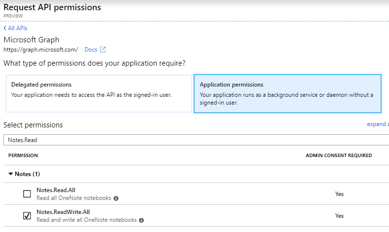
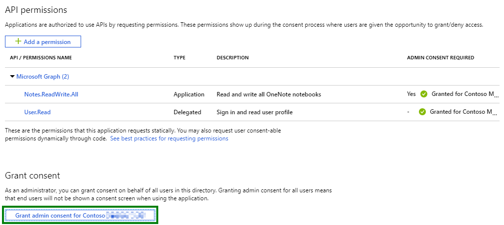

# Day 25 - Create a OneNote notebook and page

- [Day 25 - Create a OneNote notebook and page](#day-25---create-a-onenote-notebook-and-page)
  - [Prerequisites](#prerequisites)
  - [Step 1: Update the App Registration permissions](#step-1-update-the-app-registration-permissions)
  - [Step 2: Extend the app to OneNote](#step-2-extend-the-app-to-onenote)
    - [Create the OneNoteHelper class](#create-the-onenotehelper-class)
    - [Extend program to create a OneNote notebook, section, and page](#extend-program-to-create-a-onenote-notebook-section-and-page)

## Prerequisites

To complete this sample you need the following:

- Complete the [Base Console Application Setup](../base-console-app/)
- [Visual Studio Code](https://code.visualstudio.com/) installed on your development machine. If you do not have Visual Studio Code, visit the previous link for download options. (**Note:** This tutorial was written with Visual Studio Code version 1.28.2. The steps in this guide may work with other versions, but that has not been tested.)
- [.Net Core SDK](https://www.microsoft.com/net/download/dotnet-core/2.1#sdk-2.1.403). (**Note** This tutorial was written with .Net Core SDK 2.1.403.  The steps in this guide may work with other versions, but that has not been tested.)
- [C# extension for Visual Studio Code](https://marketplace.visualstudio.com/items?itemName=ms-vscode.csharp)
- Either a personal Microsoft account with a mailbox on Outlook.com, or a Microsoft work or school account.

If you don't have a Microsoft account, there are a couple of options to get a free account:

- You can [sign up for a new personal Microsoft account](https://signup.live.com/signup?wa=wsignin1.0&rpsnv=12&ct=1454618383&rver=6.4.6456.0&wp=MBI_SSL_SHARED&wreply=https://mail.live.com/default.aspx&id=64855&cbcxt=mai&bk=1454618383&uiflavor=web&uaid=b213a65b4fdc484382b6622b3ecaa547&mkt=E-US&lc=1033&lic=1).
- You can [sign up for the Office 365 Developer Program](https://developer.microsoft.com/office/dev-program) to get a free Office 365 subscription.

## Step 1: Update the App Registration permissions

As this exercise requires new permissions the App Registration needs to be updated to include the **Notes.ReadWrite.All** permission using the new Azure AD Portal App Registrations UI (in preview as of the time of publish Nov 2018).

1. Open a browser and navigate to the [App registrations page](https://go.microsoft.com/fwlink/?linkid=2083908) within the Azure AD Portal. Login using a **personal account** (aka: Microsoft Account) or **Work or School Account** with permissions to create app registrations.

    > **Note:** If you do not have permissions to create app registrations contact your Azure AD domain administrators.

1. Click on the **.NET Core Graph Tutorial** item in the list

    > **Note:** If you used a different name while completing the [Base Console Application Setup](../base-console-app/) select that instead.

1. Click **API permissions** from the current blade content.

    1. Click **Add a permission** from the current blade content.
    1. On the **Request API permissions** flyout select **Microsoft Graph**.

        

    1. Select **Application permissions**.
    1. In the "Select permissions" search box type "Notes.Read".
    1. Select **Notes.ReadWrite.All** from the filtered list.

        

    1. Click **Add permissions** at the bottom of flyout.

1. Back on the API permissions content blade, click **Grant admin consent for \<name of tenant\>**.

    

    1. Click **Yes**.

## Step 2: Extend the app to OneNote

In this step you will create a OneNoteHelper class that encapsulates the logic for getting and creating OneNote notebooks, sections, and pages and then add calls to the console application created in the [Base Console Application Setup](../base-console-app/) to implement each of these functionalities.

### Create the OneNoteHelper class

1. Create a new file in the `Helpers` folder called `OneNoteHelper.cs`.
1. Replace the contents of `OneNoteHelper.cs` with the following code:

    ```cs
    using System;
    using System.Collections.Generic;
    using System.IO;
    using System.Net.Http;
    using System.Threading.Tasks;
    using Microsoft.Graph;

    namespace ConsoleGraphTest
    {
        public class OneNoteHelper
        {

        }
    }
    ```

1. Inside the `OneNoteHelper` class add a private **GraphServiceClient**, **HttpClient**, and constructors for the class using each separately.

    ```cs
    private GraphServiceClient _graphClient;
    private HttpClient _httpClient;
    public OneNoteHelper(GraphServiceClient graphClient)
    {
        if (null == graphClient) throw new ArgumentNullException(nameof(graphClient));
        _graphClient = graphClient;
    }

    public OneNoteHelper(HttpClient httpClient)
    {
        if (null == httpClient) throw new ArgumentNullException(nameof(httpClient));
        _httpClient = httpClient;
    }
    ```

1. Next add methods to get and create a OneNote notebook.

    ```cs
    public Notebook GetNotebook(string upn, string notebookName)
    {
        List<QueryOption> options = new List<QueryOption>
        {
            new QueryOption("$filter", $"DisplayName eq '{notebookName}'")
        };
        var notebooks = (_graphClient.Users[upn].Onenote.Notebooks.Request(options).GetAsync()).Result;

        if(notebooks.Count > 0)
        {
            return notebooks[0];
        }
        else
        {
            return null;
        }
    }

    public async Task<Notebook> CreateNoteBook(string upn, string notebookName)
    {
        var notebook = new Notebook{
            DisplayName = notebookName
        };

        return (await _graphClient.Users[upn].Onenote.Notebooks.Request().AddAsync(notebook));
    }
    ```

1. Next add methods to get and create a section in a OneNote notebook.

    ```cs
    public OnenoteSection GetSection(string upn, Notebook notebook, string sectionName)
    {
        List<QueryOption> options = new List<QueryOption>
        {
            new QueryOption("$filter", $"DisplayName eq '{sectionName}'")
        };

        var sections = (_graphClient.Users[upn].Onenote.Notebooks[notebook.Id].Sections.Request(options).GetAsync()).Result;

        if(sections.Count > 0)
        {
            return sections[0];
        }
        else
        {
            return null;
        }
    }

    public async Task<OnenoteSection> CreateSection(string upn, Notebook notebook, string sectionName)
    {
        var section = new OnenoteSection{
            DisplayName = sectionName
        };

        return (await _graphClient.Users[upn].Onenote.Notebooks[notebook.Id].Sections.Request().AddAsync(section));
    }
    ```

1. Last add methods to get and create a page in a OneNote section.

    ```cs
    public OnenotePage GetPage(string upn, OnenoteSection section, string pageName)
    {
        List<QueryOption> options = new List<QueryOption>
        {
            new QueryOption("$filter", $"Title eq '{pageName}'")
        };

        var pages = (_graphClient.Users[upn].Onenote.Sections[section.Id].Pages.Request(options).GetAsync()).Result;

        if(pages.Count > 0)
        {
            return pages[0];
        }
        else
        {
            return null;
        }
    }

    public async Task<HttpResponseMessage> CreatePage(string upn, OnenoteSection section, string pageName)
    {
        Uri Uri = new Uri($"https://graph.microsoft.com/v1.0/users/{upn}/onenote/sections/{section.Id}/pages");

        // use a verbatim interpolated string to represetnt the HTML text to be used for page creation
        var html = $@"
        <!DOCTYPE html>
        <html>
        <head>
            <title>{pageName}</title>
        </head>
        <body>
            I'm learning about the Microsoft Graph!
        </body>
        </html>";

        HttpContent httpContent = new StringContent(html, System.Text.Encoding.UTF8, "application/xhtml+xml");

        return (await _httpClient.PostAsync(Uri, httpContent));
    }
    ```

### Extend program to create a OneNote notebook, section, and page

1. Inside the `Program` class add a new method `OneNoteHelperCall` with the following definition.  This method creates a OneNote notebook, section, and page.  If any of these are already created then it will get a reference to the existing items (except for page which is always created).

    ```cs
    private static void OneNoteHelperCall()
    {
        const string userPrincipalName = "<userPrincipalName>";
        const string notebookName = "Microsoft Graph notes";
        const string sectionName = "Required Reading";
        const string pageName = "30DaysMSGraph";

        var onenoteHelper = new OneNoteHelper(_graphServiceClient);
        var onenoteHelperHttp = new OneNoteHelper(_httpClient);

        var notebookResult = onenoteHelper.GetNotebook(userPrincipalName, notebookName) ?? onenoteHelper.CreateNoteBook(userPrincipalName, notebookName).GetAwaiter().GetResult();
        Console.WriteLine("Found / created notebook: " + notebookResult.DisplayName);

        var sectionResult = onenoteHelper.GetSection(userPrincipalName, notebookResult, sectionName) ?? onenoteHelper.CreateSection(userPrincipalName, notebookResult, sectionName).GetAwaiter().GetResult();
        Console.WriteLine("Found / created section: " + sectionResult.DisplayName);

        var pageCreateResult = onenoteHelperHttp.CreatePage(userPrincipalName, sectionResult, pageName).GetAwaiter().GetResult();

        var pageGetResult = onenoteHelper.GetPage(userPrincipalName, sectionResult, pageName);
        Console.WriteLine("Found / created page: " + pageGetResult.Title);
    }
    ```

    > **Important** Be sure to replace `<userPrincipalName>` with a valid UPN within your tenant.

1. Continuing in the `Main` method add the following code to call the new method.

    ```cs
    OneNoteHelperCall();
    ```

1. Save all files.

The console application is now able to create a OneNote notebook, section, and page. In order to test the console application run the following commands from the command line:

```
dotnet build
dotnet run
```
