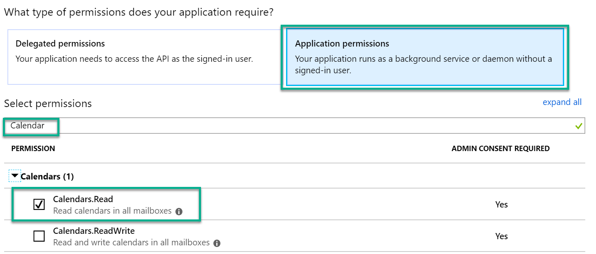
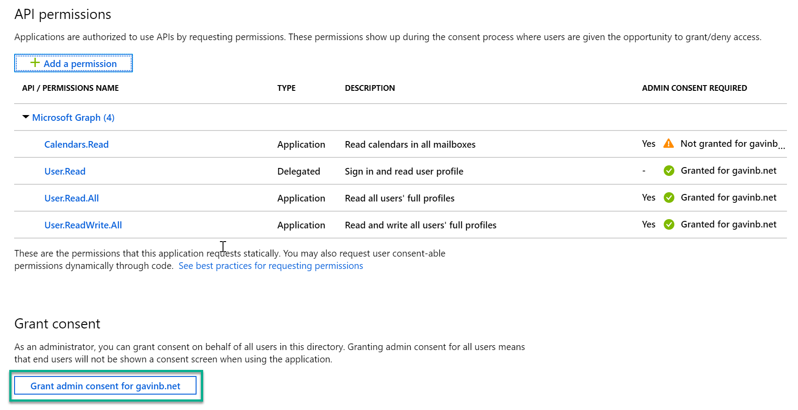
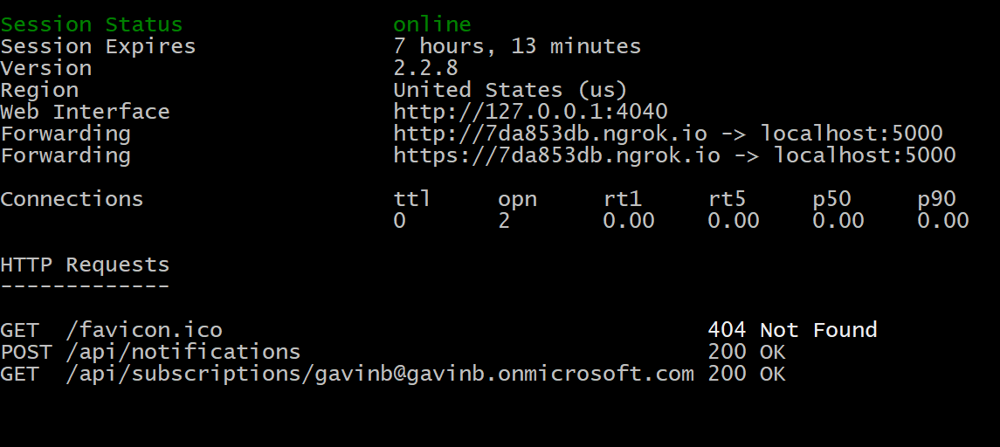
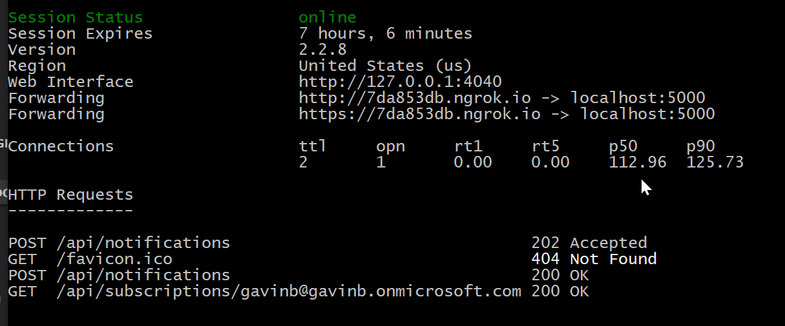

# Day 28 - Webhooks

- [Day 28 - Webhooks](#day-28---webhooks)
  - [Prerequisites](#prerequisites)
  - [Step 1: Update the App Registration permissions](#step-1-update-the-app-registration-permissions)
  - [Step 2: Create the Web API](#step-2-create-the-web-api)
    - [Create the Web API Project](#create-the-web-api-project)
  - [Step 3: Add authentication code](#step-3-add-authentication-code)
    - [Set configuration values from Azure AD App regisrtration](#set-configuration-values-from-azure-ad-app-regisrtration)
    - [Setup Authentication helper classes](#setup-authentication-helper-classes)
  - [Step 4: Setup Models and Controllers](#step-4-setup-models-and-controllers)
    - [Add SubscriptionsRepository and supporting model classes](#add-subscriptionsrepository-and-supporting-model-classes)
    - [Add the controllers](#add-the-controllers)
  - [Step 5: Run the application](#step-5-run-the-application)

## Prerequisites

To complete this sample you need the following:

- Complete the [Base Console Application Setup](../base-console-app/)
- [Visual Studio Code](https://code.visualstudio.com/) installed on your development machine. If you do not have Visual Studio Code, visit the previous link for download options. (**Note:** This tutorial was written with Visual Studio Code version 1.28.2. The steps in this guide may work with other versions, but that has not been tested.)
- [.Net Core SDK](https://www.microsoft.com/net/download/dotnet-core/2.1#sdk-2.1.403). (**Note** This tutorial was written with .Net Core SDK 2.1.403.  The steps in this guide may work with other versions, but that has not been tested.)
- [C# extension for Visual Studio Code](https://marketplace.visualstudio.com/items?itemName=ms-vscode.csharp)
- Either a personal Microsoft account with a mailbox on Outlook.com, or a Microsoft work or school account.
- [ngrok](https://ngrok.com/) A secure agent to proxy your development environment onto the internet.

If you don't have a Microsoft account, there are a couple of options to get a free account:

- You can [sign up for a new personal Microsoft account](https://signup.live.com/signup?wa=wsignin1.0&rpsnv=12&ct=1454618383&rver=6.4.6456.0&wp=MBI_SSL_SHARED&wreply=https://mail.live.com/default.aspx&id=64855&cbcxt=mai&bk=1454618383&uiflavor=web&uaid=b213a65b4fdc484382b6622b3ecaa547&mkt=E-US&lc=1033&lic=1).
- You can [sign up for the Office 365 Developer Program](https://developer.microsoft.com/office/dev-program) to get a free Office 365 subscription.

## Step 1: Update the App Registration permissions

As this exercise requires new permissions the App Registration needs to be updated to include the **Calendar.Read** permission using the new Azure AD Portal App Registrations UI (in preview as of the time of publish Nov 2018).

1. Open a browser and navigate to the [App registrations page](https://go.microsoft.com/fwlink/?linkid=2083908) within the Azure AD Portal. Login using a **personal account** (aka: Microsoft Account) or **Work or School Account** with permissions to create app registrations.

    > **Note:** If you do not have permissions to create app registrations contact your Azure AD domain administrators.

1. Click on the **.NET Core Graph Tutorial** item in the list

    > **Note:** If you used a different name while completing the [Base Console Application Setup](../base-console-app/) select that instead.

1. Click **API permissions** from the current blade content.

    1. Click **Add a permission** from the current blade content.
    1. On the **Request API permissions** flyout select **Microsoft Graph**.

        

    1. Select **Application permissions**.
    1. In the "Select permissions" search box type "Calendar".
    1. Select **Calendar.Read** from the filtered list.

        

    1. Click **Add permissions** at the bottom of flyout.

1. Back on the API permissions content blade, click **Grant admin consent for \<name of tenant\>**.

    

    1. Click **Yes**.

## Step 2: Create the Web API

In this step you will create an ASP.Net core Web API project and set up the necessary dependencies.

### Create the Web API Project

Create a folder called `GraphWebhooks` for the console application.

> **Note:** For the purposes of this sample the project folder was named **GraphWebhooks**. If you choose a different folder name ensure that the namespace for files matches.

1. Open the command line and navigate to this folder.  Run the following command:

    ```bash
    dotnet new webapi
    ```

1. Before moving on, install the following NuGet packages that you will use later.

    - Microsoft.Identity.Client
    - Microsoft.Graph
    - Microsoft.Extensions.Configuration
    - Microsoft.Extensions.Configuration.Json

    Run the following commands to install these NuGet packages:

    ```bash
    dotnet add package Microsoft.Identity.Client --version 2.3.1-preview
    dotnet add package Microsoft.Graph
    dotnet add package Microsoft.Extensions.Configuration
    dotnet add package Microsoft.Extensions.Configuration.Json
    ```

## Step 3: Add authentication code

In this step you will set up the classes and configuration that will be used to authenticate requests to Microsoft Graph

### Set configuration values from Azure AD App regisrtration

1. On the command line from Step 2, run the following command inside the project folder to open Visual Studio Code with the project folder opened:

    ```bash
    code .
    ```

1. Rename the `appsettings.example.json` file to `appsettings.json` and open it.

1. Fill in the appropriate values for the following settings in the `appsettings.json` file. These can be transscribed from the appsettings that were used for the console application from day 16.

    ```json
    "applicationId": "",
    "applicationSecret": "",
    "tenantId": "",
    "redirectUri": "",
    "baseUrl": ""
    ```

    > **Note:** `baseUrl` will be filled in at a later step.  Leave it empty for now.

1. Open the `Startup.cs` file add a new method called `ValidateConfig()`:

    ```cs
    private void ValidateConfig()
    {
        // Validate required settings
        if (string.IsNullOrEmpty(Configuration["applicationId"]) ||
            string.IsNullOrEmpty(Configuration["applicationSecret"]) ||
            string.IsNullOrEmpty(Configuration["redirectUri"]) ||
            string.IsNullOrEmpty(Configuration["tenantId"]) ||
            string.IsNullOrEmpty(Configuration["baseUrl"]))
        {
            throw new ApplicationException("The configuration is invalid, are you missing some keys?");
        }
    }
    ```

1. Edit the `Configure` method so that it matches this listing:

    ```cs
    public void Configure(IApplicationBuilder app, IHostingEnvironment env)
    {
        ValidateConfig();
        if (env.IsDevelopment())
        {
            app.UseDeveloperExceptionPage();
        }
        else
        {
            app.UseHsts();
            app.UseHttpsRedirection();
        }

        app.UseMvc();
    }
    ```

    > **Note:** that UseHttpsRedirection is only called for production configurations, this is to allow ngrok to call the http endpoint and not encounter SSL validation issues when running on localhost.

1. Configure the ngrok tunnel and settings:

    1. Open a separate command line window.
    1. Run the folowing to start your ngrok tunnel

        ```bash
        ngrok http 5000
        ```

        > **Note:** If you did not yet install the [ngrok](https://ngrok.com/) tool from the prerequisites please do so now.  Be sure to place the `ngrok.exe` tool in an accesible location or update your PATH environment variable to include the containing folder.

    1. Copy the https Forwarding url shown
        
    1. In VSCode Paste the copied URL into the baseUrl property in `appsettings.json`

### Setup Authentication helper classes

1. Add a folder called `Helpers`

1. In the `Helpers` folder create a file called `AuthHander.cs` with this listing:

    ```cs
    using System;
    using System.Collections.Generic;
    using System.Net.Http;
    using System.Net.Http.Headers;
    using System.Threading.Tasks;
    using Microsoft.Identity.Client;
    using Microsoft.Graph;
    using Microsoft.Extensions.Configuration;
    using System.Linq;
    using System.Threading;

    namespace GraphWebhooks
    {
        // This class allows an implementation of IAuthenticationProvider to be inserted into the DelegatingHandler
        // pipeline of an HttpClient instance.  In future versions of GraphSDK, many cross-cutting concerns will
        // be implemented as DelegatingHandlers.  This AuthHandler will come in the box.
        public class AuthHandler : DelegatingHandler
        {
            private IAuthenticationProvider _authenticationProvider;

            public AuthHandler(IAuthenticationProvider authenticationProvider, HttpMessageHandler innerHandler)
            {
                InnerHandler = innerHandler;
                _authenticationProvider = authenticationProvider;
            }

            protected override async Task<HttpResponseMessage> SendAsync(HttpRequestMessage request, CancellationToken cancellationToken)
            {
                await _authenticationProvider.AuthenticateRequestAsync(request);
                return await base.SendAsync(request, cancellationToken);
            }
        }
    }
    ```

1. In the `Handlers` folder create a file called `MsalAuthenticationProvider.cs` with this listing:

    ```cs
    using System;
    using System.Collections.Generic;
    using System.Net.Http;
    using System.Net.Http.Headers;
    using System.Threading.Tasks;
    using Microsoft.Identity.Client;
    using Microsoft.Graph;
    using Microsoft.Extensions.Configuration;
    using System.Linq;

    namespace GraphWebhooks
    {
        // This class encapsulates the details of getting a token from MSAL and exposes it via the
        // IAuthenticationProvider interface so that GraphServiceClient or AuthHandler can use it.
        // A significantly enhanced version of this class will in the future be available from
        // the GraphSDK team.  It will supports all the types of Client Application as defined by MSAL.
        public class MsalAuthenticationProvider : IAuthenticationProvider
        {
            private IConfidentialClientApplication _clientApplication;
            private string[] _scopes;

            public MsalAuthenticationProvider(IConfidentialClientApplication clientApplication, string[] scopes)
            {
                _clientApplication = clientApplication;
                _scopes = scopes;
            }

            /// <summary>
            /// Update HttpRequestMessage with credentials
            /// </summary>
            public async Task AuthenticateRequestAsync(HttpRequestMessage request)
            {
                var token = await GetTokenAsync();
                request.Headers.Authorization = new AuthenticationHeaderValue("bearer", token);
            }

            /// <summary>
            /// Acquire Token
            /// </summary>
            public async Task<string> GetTokenAsync()
            {
                AuthenticationResult authResult = null;
                authResult = await _clientApplication.AcquireTokenForClient(_scopes)
                                    .ExecuteAsync();
                return authResult.AccessToken;
            }
        }
    }
    ```

1. In the `Helpers` folder create a file called `MsalAuthenticationProviderFactory.cs` with the following listing:

    ```cs

    using System.Collections.Generic;
    using System.Net.Http;
    using Microsoft.Extensions.Configuration;
    using Microsoft.Graph;
    using Microsoft.Identity.Client;

    namespace GraphWebhooks
    {
        // This class encapsulates the details of getting a token from MSAL and exposes it via the
        // IAuthenticationProvider interface so that GraphServiceClient or AuthHandler can use it.
        // A significantly enhanced version of this class will in the future be available from
        // the GraphSDK team.  It will supports all the types of Client Application as defined by MSAL.
        public class GraphHttpClientFactory
        {
            public static HttpClient GetAuthenticatedHTTPClient(IConfiguration config)
            {
                var authenticationProvider = BuildAuthProvider(config);
                return new HttpClient(new AuthHandler(authenticationProvider, new HttpClientHandler()));
            }

            private static IAuthenticationProvider BuildAuthProvider(IConfiguration config)
            {
                var clientId = config["applicationId"];
                var clientSecret = config["applicationSecret"];
                var redirectUri = config["redirectUri"];
                var authority = $"https://login.microsoftonline.com/{config["tenantId"]}/v2.0";

                //this specific scope means that application will default to what is defined in the application registration rather than using dynamic scopes
                List<string> scopes = new List<string>();
                scopes.Add("https://graph.microsoft.com/.default");

                var cca = ConfidentialClientApplicationBuilder.Create(clientId)
                                                        .WithAuthority(authority)
                                                        .WithRedirectUri(redirectUri)
                                                        .WithClientSecret(clientSecret)
                                                        .Build();

                return new MsalAuthenticationProvider(cca, scopes.ToArray());
            }
        }
    }
    ```

1. In `Startup.cs` edit the `ConfigureServices` method and add the following line:

    ```cs
    services.AddSingleton<HttpClient>(GraphHttpClientFactory.GetAuthenticatedHTTPClient(Configuration));
    ```

    > This registers an instance of the HttpClient class pre-configured with the necessary authentication context with the Dependency Injection system that is baked into ASP.NET Core.

## Step 4: Setup Models and Controllers

### Add SubscriptionsRepository and supporting model classes

In this step you will create the classes to serialize and deserialize all of the requests needed when working with webhooks and create an in-memory repository for tracking subscriptions.

1. Add a folder called `Models`

1. In the `Models` folder create a new file called `NotificationUrl.cs` with the following listing:

    ```cs
    namespace GraphWebhooks
    {
        public class NotificationUrl
        {
            public string Url { get; set; }
        }
    }

    ```

1. In the `Models` folder create a new file called `ResourceData.cs` with the following listing:

    ```cs
    using Newtonsoft.Json;

    namespace GraphWebhooks
    {
        public class ResourceData
        {
            [JsonProperty("@odata.type")]
            public string OdataType { get; set; }

            [JsonProperty("@odata.id")]
            public string OdataId { get; set; }

            [JsonProperty("@odata.etag")]
            public string OdataEtag { get; set; }

            [JsonProperty("id")]
            public string Id { get; set; }
        }
    }
    ```

1. In the `Models` folder create a new file called `Notification.cs` with the following listing:

    ```cs
    using System;
    using Microsoft.AspNetCore.Mvc.ModelBinding;
    using Newtonsoft.Json;

    namespace GraphWebhooks
    {
        public class Notification
        {
            [JsonProperty("subscriptionId")]
            public string SubscriptionId { get; set; }

            [JsonProperty("subscriptionExpirationDateTime")]
            public DateTimeOffset SubscriptionExpirationDateTime { get; set; }

            [JsonProperty("clientState")]
            public string ClientState { get; set; }

            [JsonProperty("changeType")]
            public string ChangeType { get; set; }

            [JsonProperty("resource")]
            public string Resource { get; set; }

            [JsonProperty("resourceData")]
            public ResourceData ResourceData { get; set; }
        }
    }
    ```

1. In the `Models` folder create a new file called `Notifications.cs` with the following listing:

    ```cs
    using System.Collections.Generic;
    using Newtonsoft.Json;

    namespace GraphWebhooks
    {
        public class Notifications
        {
            [JsonProperty("value")]
            public IEnumerable<Notification> value { get; set; }
        }
    }
    ```

1. Create a folder called `Repositories`

1. In the `Repositories` folder create a file called `SubscriptionRepository.cs` with the following listing:

    ```cs
    using System;
    using System.Collections.Generic;
    using System.Linq;
    using Microsoft.Graph;
    using Newtonsoft.Json;

    namespace GraphWebhooks
    {
        public interface ISubscriptionRepository
        {
            void Save(Subscription subscription);
            void Delete(string id);
            Subscription Load(string id);
            Subscription LoadByUpn(string upn);
        }

        public class SubscriptionRepository : ISubscriptionRepository
        {
            private IList<Subscription> _subscriptions;

            public SubscriptionRepository()
            {
                _subscriptions = new List<Subscription>();
            }

            public void Save(Subscription subscription) => _subscriptions.Add(subscription);

            public void Delete(string id)
            {
                var toDelete = Load(id);
                _subscriptions.Remove(toDelete);
            }

            public Subscription Load(string id) => _subscriptions.FirstOrDefault(s => s.Id == id);

            public Subscription LoadByUpn(string upn) => _subscriptions.FirstOrDefault(s => s.Resource.Contains($"/{upn}/"));
        }
    }
    ```

    > In a production system the `SubscriptionRepository` implementation would certainly be connected to some form of cloud storage system such as CosmosDb or Azure SQL.

1. In the `Startup.cs` file edit the `ConfigureServices` method to add the following lines:

    ```cs
    services.AddSingleton<ISubscriptionRepository>(new SubscriptionRepository());
    services.AddSingleton<NotificationUrl>(new NotificationUrl { Url = $"{Configuration["baseUrl"]}/api/notifications" });
    ```

### Add the controllers

In this step you will define the Subscription and Notifcation controllers to handle the requests required to register subscriptions and handle notifications.

1. In the `Helpers` folder create a new file called `HttpRequestExtensions.cs` with the following listing:

    ```cs
    using System.IO;
    using System.Text;
    using System.Threading.Tasks;
    using Microsoft.AspNetCore.Http;
    using Newtonsoft.Json;

    namespace GraphWebhooks.Controllers
    {
        public static class HttpRequestExtensions
        {
            /// <summary>
            /// Convert the Request.Body stream into an object of T
            /// </summary>
            /// <param name="request">Request instance to apply to</param>
            /// <param name="encoding">Optional - Encoding, defaults to UTF8</param>
            /// <returns></returns>
            public static async Task<T> GetBodyAsync<T>(this HttpRequest request, Encoding encoding = null)
            {
                if (encoding == null)
                    encoding = Encoding.UTF8;

                using (StreamReader reader = new StreamReader(request.Body, encoding))
                {
                    return JsonConvert.DeserializeObject<T>(await reader.ReadToEndAsync());
                }
            }
        }
    }
    ```

    > This extension method is necessary as it's not possible in ASP.NET Core to have a both FromQuery and FromBody parameters on a single method where only one parameter is supplied.

1. In the `Controllers` folder delete the existing `ValuesController.cs` file

1. In the `Controllers` folder add a file called SubscriptionsController with the following listing:

    ```cs
    using System;
    using System.Collections.Generic;
    using System.Linq;
    using System.Net.Http;
    using System.Threading.Tasks;
    using Microsoft.AspNetCore.Mvc;
    using Microsoft.Graph;
    using Newtonsoft.Json;

    namespace GraphWebhooks.Controllers
    {

        [Route("api/[controller]")]
        [ApiController]
        public class SubscriptionsController : ControllerBase
        {
            private const string _subscriptionsResource = "https://graph.microsoft.com/v1.0/subscriptions";
            private readonly ISubscriptionRepository _subscriptionRepository;
            private readonly HttpClient _graphClient;
            private readonly NotificationUrl _notificationUrl;

            public SubscriptionsController(ISubscriptionRepository subscriptionRepository, HttpClient graphClient, NotificationUrl notificationUrl)
            {
                if (subscriptionRepository == null) throw new ArgumentNullException(nameof(subscriptionRepository));
                if (graphClient == null) throw new ArgumentNullException(nameof(graphClient));
                if (notificationUrl == null) throw new ArgumentNullException(nameof(notificationUrl));
                _subscriptionRepository = subscriptionRepository;
                _graphClient = graphClient;
                _notificationUrl = notificationUrl;
            }

            // GET api/subscriptions/alias@domain.com
            [HttpGet("{upn}")]
            public async Task<ActionResult<Subscription>> Get(string upn)
            {
                var result = _subscriptionRepository.LoadByUpn(upn);
                if (result != null && result.ExpirationDateTime > DateTime.Now)
                {
                    return result;
                }
                string clientState = Guid.NewGuid().ToString("d");
                var request = new Subscription
                {
                    ChangeType = "created",
                    ExpirationDateTime = DateTime.Now.AddDays(2),
                    ClientState = clientState,
                    Resource = $"users/{upn}/events",
                    NotificationUrl = _notificationUrl.Url
                };
                var response = await _graphClient.PostAsJsonAsync(_subscriptionsResource, request);
                string responseBody = await response.Content.ReadAsStringAsync();

                if (!response.IsSuccessStatusCode)
                {
                    Console.WriteLine(response.ReasonPhrase);
                    var error = new ObjectResult(responseBody);
                    error.StatusCode = 500;
                    return error;
                }
                Subscription subscription = JsonConvert.DeserializeObject<Subscription>(responseBody);
                _subscriptionRepository.Save(subscription);
                return subscription;
            }

            // DELETE api/subscriptions/a7aebd9c-1f8b-41a0-a973-47b7296975c3
            [HttpDelete("{id}")]
            public async Task<IActionResult> Delete(string id)
            {
                var response = await _graphClient.DeleteAsync($"{_subscriptionsResource}/{id}");
                string responseBody = await response.Content.ReadAsStringAsync();
                if (!response.IsSuccessStatusCode)
                {
                    Console.WriteLine(response.ReasonPhrase);
                    var error = new ObjectResult(responseBody);
                    error.StatusCode = 500;
                    return error;
                }
                _subscriptionRepository.Delete(id);
                return new StatusCodeResult(204);
            }
        }
    }
    ```

    > The Subscriptions controller allows a developer to register a subscription for calendar events. For convienence it also provides a DELETE method to remove any subscription that have been created.

1. In the `Controllers` folder create a new file `NotificationsController.cs` with the following listing:

    ```cs
    using System;
    using System.Collections.Generic;
    using System.IO;
    using System.Linq;
    using System.Net.Http;
    using System.Text;
    using System.Threading.Tasks;
    using Microsoft.AspNetCore.Http;
    using Microsoft.AspNetCore.Mvc;
    using Microsoft.Graph;
    using Newtonsoft.Json;

    namespace GraphWebhooks.Controllers
    {
        [Route("api/[controller]")]
        [ApiController]
        public class NotificationsController : ControllerBase
        {
            private readonly ISubscriptionRepository _subscriptionRepository;
            private readonly HttpClient _graphClient;

            public NotificationsController(ISubscriptionRepository subscriptionRepository, HttpClient graphClient)
            {
                if (subscriptionRepository == null) throw new ArgumentNullException(nameof(subscriptionRepository));
                if (graphClient == null) throw new ArgumentNullException(nameof(graphClient));
                _subscriptionRepository = subscriptionRepository;
                _graphClient = graphClient;
            }

            [HttpPost]
            public async Task<ActionResult> Listen([FromQuery] string validationToken)
            {
                if (!string.IsNullOrEmpty(validationToken))
                {
                    return Content(validationToken, "plain/text");
                }
                try
                {
                    // Read the post body directly as we can't mix optional FromBody and FromQuery parameters
                    var postBody = await Request.GetBodyAsync<Notifications>();
                    foreach (var item in postBody.value)
                    {
                        await ProcessEventNotification(item);
                    }
                }
                catch (Exception)
                {
                    // Just ignore exceptions
                }
                // Send a 202 so MicrosoftGraph knows we processed the notification
                return new StatusCodeResult(202);
            }

            private async Task ProcessEventNotification(Notification item)
            {
                var subscription = _subscriptionRepository.Load(item.SubscriptionId);
                // We should only process requests for which we have ClientState stored
                if (subscription != null && item.ClientState == subscription.ClientState)
                {
                    Uri Uri = new Uri($"https://graph.microsoft.com/v1.0/{item.Resource}");
                    var httpResult = await _graphClient.GetStringAsync(Uri);
                    var calendarEvent = JsonConvert.DeserializeObject<Event>(httpResult);
                    // Do processing of your subscribed entity
                    Console.WriteLine(httpResult);
                    if (string.IsNullOrWhiteSpace(calendarEvent.BodyPreview))
                    {
                        // Decline the meeting as it has no agenda
                    }
                }
            }
        }
    }
    ```

    > The NotificationsController is responsible for recieving notfication requests from Microsoft Graph

## Step 5: Run the application

The Web API is now able to register subscriptions and handle incoming notifications. In order to test the Web API run the following commands from the command line:

1. Save all files.

    ```bash
    dotnet build
    dotnet run
    ```

1. From the command line running ngrok copy the https forwading url.

1. Open a web browser at `<ngrokUrl>/api/subscriptions/<known-upn>`, ex. <https://891b8419.ngrok.io/api/subscriptions/sdt_test@contoso.com.>

1. You will see two api requests logged in the ngrok console
    

1. Send a meeting request to the email address used to create the subscription

1. You will see another api request to the NotificationsController with an http 202 result and some information logged to the console.
    

This completes the exercise to set up a Web API for registering subscriptions and handing notifications. The overall flow and chain of actions shown here is the same pattern no matter what notifications you wish to recieve or which language you use to implement your solution.