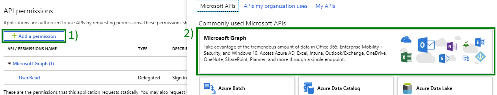

# Day NN - Scenario Template

> When adding Images, save them in the Images folder for your day

- [Day NN - Scenario Template](#day-nn-scenario-template)
    - [Prerequisites](#prerequisites)
    - [Step 1: Update the App Registration permissions](#step-1-update-the-app-rgistration-permissions)
    - [Step 2: Extend the app to yyy](#step-2-extend-the-app-to-yyy)
        - [Create the MyHelper class](#create-the-myhelper-class)
        - [Extend program to yyy](#extend-program-to-yyy)

## Prerequisites

To complete this sample you need the following:

- Complete the [Base Console Application Setup](../base-console-app/)
- [Visual Studio Code](https://code.visualstudio.com/) installed on your development machine. If you do not have Visual Studio Code, visit the previous link for download options. (**Note:** This tutorial was written with Visual Studio Code version 1.41.1. The steps in this guide may work with other versions, but that has not been tested.)
- [.Net Core SDK](https://dotnet.microsoft.com/download/dotnet-core/3.1#sdk-3.1.100). (**Note** This tutorial was written with .Net Core SDK 3.1.100.  The steps in this guide may work with other versions, but that has not been tested.)
- [C# extension for Visual Studio Code](https://marketplace.visualstudio.com/items?itemName=ms-vscode.csharp)
- Either a personal Microsoft account with a mailbox on Outlook.com, or a Microsoft work or school account.

If you don't have a Microsoft account, there are a couple of options to get a free account:

- You can [sign up for a new personal Microsoft account](https://signup.live.com/signup?wa=wsignin1.0&rpsnv=12&ct=1454618383&rver=6.4.6456.0&wp=MBI_SSL_SHARED&wreply=https://mail.live.com/default.aspx&id=64855&cbcxt=mai&bk=1454618383&uiflavor=web&uaid=b213a65b4fdc484382b6622b3ecaa547&mkt=E-US&lc=1033&lic=1).
- You can [sign up for the Office 365 Developer Program](https://developer.microsoft.com/office/dev-program) to get a free Office 365 subscription.


## Step 1: Update the App Registration permissions

As this exercise requires new permissions the App Registration needs to be updated to include the **\<New-Permission-Here\>** permission using the new Azure AD Portal App Registrations UI.

1. Open a browser and navigate to the [App registrations page](https://go.microsoft.com/fwlink/?linkid=2083908) within the Azure AD Portal. Login using a **personal account** (aka: Microsoft Account) or **Work or School Account** with permissions to create app registrations.

    > **Note:** If you do not have permissions to create app registrations contact your Azure AD domain administrators.

1. Click on the **.NET Core Graph Tutorial** item in the list

    > **Note:** If you used a different name while completing the [Base Console Application Setup](../base-console-app/) select that instead.

1. Click **API permissions** from the current blade content.

    1. Click **Add a permission** from the current blade content.
    1. On the **Request API permissions** flyout select **Microsoft Graph**.

        

    1. Select **[Application|Delegated] permissions**.
    1. In the "Select permissions" search box type "\<Start of permission string\>".
    1. Select **\<New-Permission-Here\>** from the filtered list.

        ![Screenshot of adding [application|delegated] permission for User.Read.All permission](Images/new-image-needed.png)

    1. Click **Add permissions** at the bottom of flyout.

1. Back on the API permissions content blade, click **Grant admin consent for \<name of tenant\>**.
**need new screenshot here**
    

    1. Click **Yes**.

## Step 2: Extend the app to yyy

In this step you will create a UserHelper class that encapsulates the logic for creating users and finding user objects by alias and then add calls to the console application created in the [Base Console Application Setup](../base-console-app/) to provision a new user.

### Create the MyHelper class

1. Create a new file in the `Helpers` folder called `MyHelperFileName.cs`.
1. Replace the contents of `MyHelperFileName.cs` with the following code:

    ```cs
    // Your code here
    ```

This class contains the code to ....

### Extend program to yyy

1. Inside the `Program` class add a new method `YourMethod` with the following definition.  This method creates a new User in Azure Active Directory using the UserHelper class. This user will enableded and be required to change their password upon their next login.

    ```cs
    // Your code here
    ```

    > **Important** Any key things to note where the developer might run into issues.

1. Continuing in the `Main` method add the following code to call the new method.

    ```cs
    YourMethod();
    ```

1. Save all files.

The console application is now able to \<do some new thing\>. In order to test the console application run the following commands from the command line:

```
dotnet build
dotnet run
```

Summary of what the thing that can be done is.
