# Extra Day 1 - Use the Microsoft Search API to query data

This sample was added after the 30 Days of Microsoft Graph blog series and as such has limited documentation.  The key points to note:

- [Extra Day 1 - Use the Microsoft Search API to query data](#Extra-Day-1---Use-the-Microsoft-Search-API-to-query-data)
  - [Prerequisites](#prerequisites)
  - [Step 1: Start Backend](#step-1-start-backend)
  - [Step 2: Start Frontend](#step-2-start-frontend)
  - [Step 3: Try the demo](#step-3-try-the-demo)
## Prerequisites

- Permissions required
  - Delegated (work or school account)
    - Mail.Read, Mail.ReadWrite, Calendars.Read, Calendars.ReadWrite, Files.Read.All, Files.ReadWrite.All, Sites.Read.All, Sites.ReadWrite.All, ExternalItem.Read.All
- [Visual Studio Code](https://code.visualstudio.com/) installed on your development machine. If you do not have Visual Studio Code, visit the previous link for download options. (**Note:** This tutorial was written with Visual Studio Code version 1.55.2. The steps in this guide may work with other versions, but that has not been tested.)
- [Visual Studio](https://visualstudio.microsoft.com/). (**Note** This tutorial was written with Visual Studio 2019. The steps in this guide may work with other versions, but that has not been tested.), when start installation, please:
  - Make sure you installed the **ASP.NET & web development** under the **Web & Cloud**
  - Make sure you installed **.Net desktop development** under the **Desktop & Mobile**
- If you want to extend authentication, please refer [the guides](/day29-onedrive) before or try to use this [MSAL sample](https://github.com/AzureAD/microsoft-authentication-library-for-js/tree/dev/samples/msal-angular-v2-samples/angular11-sample-app) or go to [Azure Document](https://docs.microsoft.com/azure/active-directory/fundamentals/auth-oidc) for getting auth helps. In this guide, please ensure you have a way to get a token for accessing graph endpoint. Try [Graph Explorer](https://developer.microsoft.com/graph/graph-explorer) and got a token from there.
   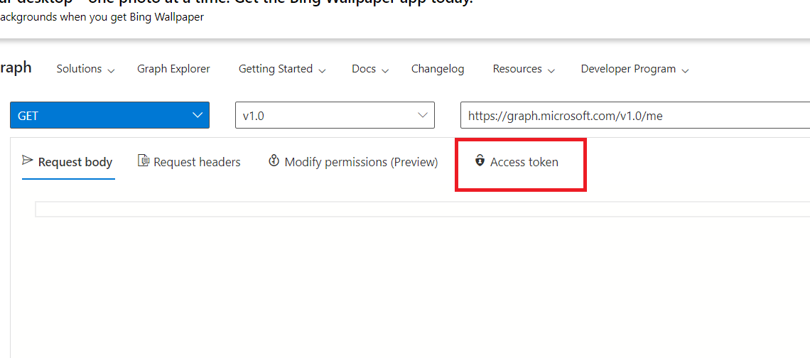
   
- [Nodejs](https://nodejs.org/en/)  This tutorial was written with NodeJS version 14.15.4. Please click the link then install the nodeJS
   
   
## Step 1: Start Backend

### Double click **day30Sample.sln** under the **extraday1-search/backend_CSharp/day30Sample**
### Open Package Manager 
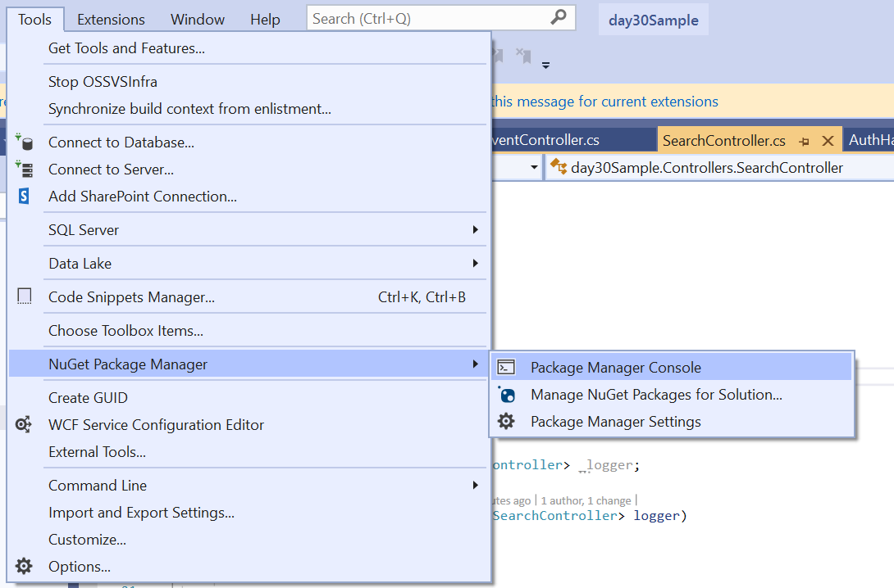, type below and enter
  ```
  dotnet restore
  ```
### Run Project
  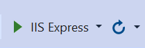

### After starting the backend, you will see below and please keep the browser window.
  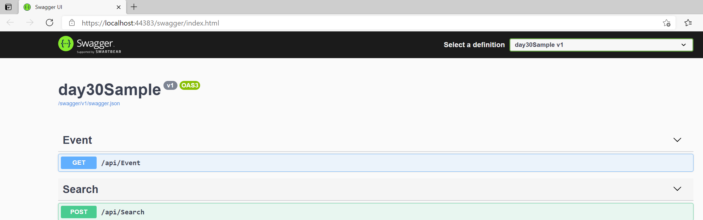
  
  
 ## Step 2: Start Frontend
 
### Open commandline on your PC
   run command below:
   ```
   npm install -g @angular/cli
   ```
   
- Open Visual Studio Code, and import frontend project.
- 
   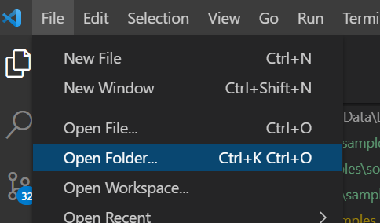
   
### Open a Terminal in Visual Studio Code

  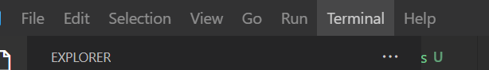
  
### Run npm install in the terminal as below, it will take a little long time:
 
  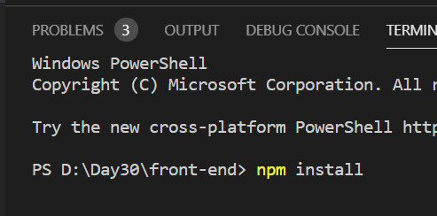

### Run ng serve, start project
  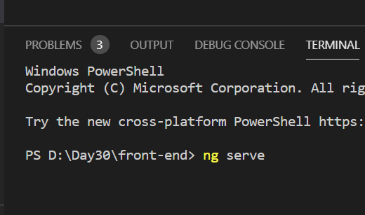
  
### After starting successfully, go http://localhost:4200, will see below:
  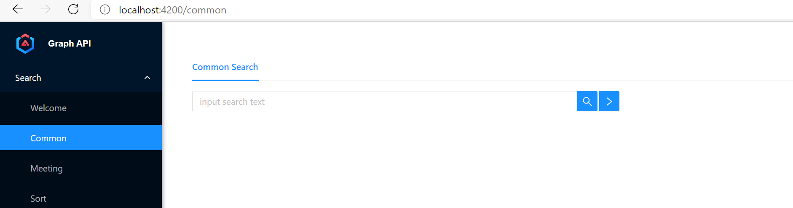
  
## Step 3: Try the demo
### **Set a token in welcome page**, [Graph Explorer](https://developer.microsoft.com/graph/graph-explorer) and got a token from there. 
   
   
  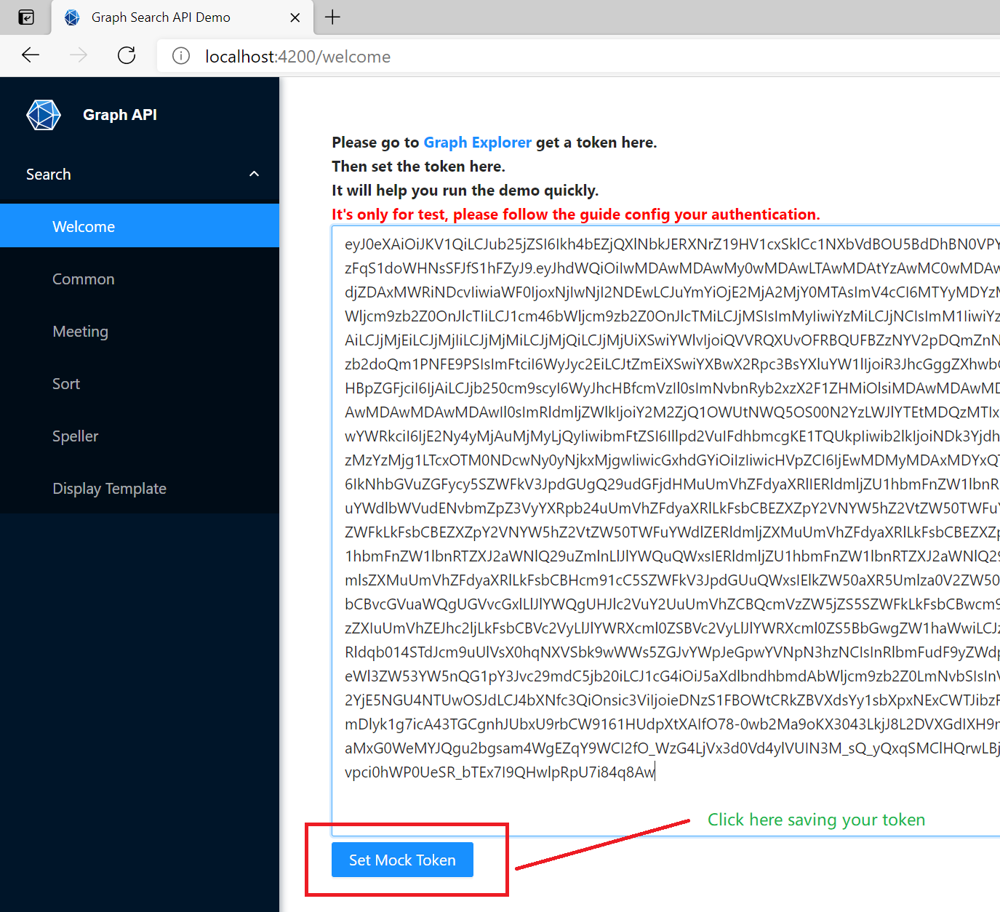
   
### **Click Search Button**, 
  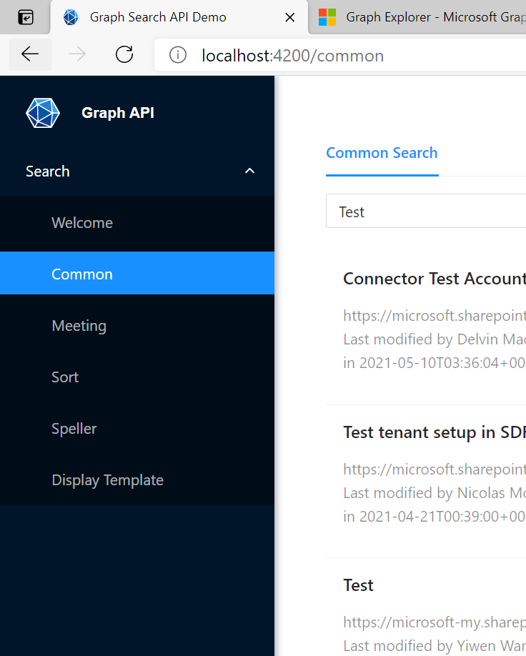
   
    
   
